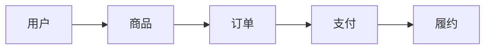

# 用户故事与产品功能架构

> User Stories & Product Functional Architecture  
> Version: 1.0

---

# 1. 文档目的

本文档定义 AI 产品经理如何将已经确认的：

* 目标用户
* 核心场景
* 核心问题
* 用户目标
* 产品定位
* MVP 范围

进一步转化为：

* 用户任务
* 用户活动
* 用户故事
* 用户故事地图
* 产品能力
* 业务模块
* 功能模块
* 功能树
* 模块关系
* 功能依赖
* 产品功能架构

本阶段主要解决两个问题：

1. **用户到底要完成什么事情？**
2. **为了支持这些用户任务，产品需要具备哪些能力和功能？**

核心目标是：

> **从用户目标出发推导产品能力，而不是凭经验直接堆功能模块。**

---

# 2. 前置条件

进入本阶段前，应至少具备：

* Primary User 基本明确
* Core Scenario 基本明确
* Core Problem 基本明确
* Product Vision 已形成
* Product Boundary 已明确
* MVP Goal 已明确
* MVP Scope 已基本确认
* 关键需求已经完成初步优先级判断

如果还无法明确：

> 谁，在什么场景下，为了什么目标使用产品？

则应返回：

> 产品定义 / Product Definition

或：

> 需求分析 / Requirement Analysis

---

# 3. 核心建模链路

本阶段应遵循：

```text
User Goal
↓
Activity
↓
Task
↓
User Story
↓
Product Capability
↓
Business Module
↓
Feature
↓
Sub-feature
```

避免：

```text
想到一个页面
↓
想到几个按钮
↓
拼成几个模块
↓
宣称这是产品架构
```

---

# 4. User Goal

User Goal 指：

> 用户最终希望完成什么目标。

例如：

用户不是为了：

> “点击导出按钮”。

而是为了：

> “快速完成经营周报”。

用户不是为了：

> “进入 AI 回复页面”。

而是为了：

> “更高效、更自然地完成一段沟通”。

---

# 5. Goal 与 Feature 的区别

错误：

```text
用户目标：
使用搜索功能
```

正确：

```text
用户目标：
快速找到需要的信息
```

“搜索”只是可能的解决方案。

---

# 6. 用户目标层级

可以根据项目复杂度区分：

## Business Goal

业务或组织目标。

例如：

> 提升客户服务效率。

## User Goal

用户直接目标。

例如：

> 快速处理客户咨询。

## Task Goal

具体任务目标。

例如：

> 找到某个客户历史订单。

## Interaction Goal

操作层目标。

例如：

> 快速筛选最近 30 天订单。

产品架构通常主要围绕：

> User Goal + Task Goal

展开。

---

# 7. Activity

Activity 是为了完成 User Goal，用户需要进行的一类较高层活动。

例如：

User Goal：

> 完成一次在线购物。

Activity 可能包括：

```text
发现商品
↓
评估商品
↓
提交订单
↓
完成支付
↓
跟踪履约
```

Activity 是 User Story Map 的 Backbone。

---

# 8. Task

Task 是 Activity 下更具体的用户任务。

例如：

Activity：

> 评估商品

Task：

* 查看商品详情
* 查看价格
* 查看库存
* 查看评价
* 对比商品
* 选择规格

---

# 9. User Story

## 9.1 标准格式

推荐：

> As a [角色]
> I want [行为 / 能力]
> So that [用户价值]

例如：

> As a 电商运营人员
> I want 快速查看上周核心经营指标
> So that 我可以减少制作周报所需的人工整理时间。

---

# 10. 好的 User Story 应该描述价值

较差：

> As a 用户，我想点击导出按钮。

更好：

> As a 运营人员，我希望获得可下载的经营数据，从而可以继续进行离线分析和汇报。

---

# 11. User Story 不等于 UI Requirement

User Story 尽量避免写死页面实现。

例如：

不推荐：

> 在右上角增加一个蓝色按钮，让用户点击后导出 Excel。

这属于：

> Interaction / UI Solution。

User Story 更应该表达：

> 用户需要完成什么任务、获得什么价值。

---

# 12. INVEST 原则

重要 User Story 可以参考 INVEST。

## Independent

尽量能够独立理解和实现。

## Negotiable

不是不可讨论的技术合同。

## Valuable

必须体现用户或业务价值。

## Estimable

研发可以理解并估算。

## Small

规模适中。

## Testable

能够验证是否完成。

---

# 13. User Story 拆分

如果 User Story 太大，需要拆分。

常见拆分方法：

## 按业务流程拆

例如：

```text
创建订单
查看订单
取消订单
完成订单
```

## 按用户角色拆

例如：

```text
普通用户
管理员
运营人员
```

## 按业务规则拆

例如：

```text
普通支付
优惠券支付
余额支付
```

## 按数据范围拆

例如：

```text
查看个人数据
查看团队数据
查看全公司数据
```

## 按 Happy Path / Exception 拆

核心版本优先主流程，再逐步补充非关键复杂能力。

---

# 14. 不推荐按技术层拆 User Story

不推荐：

```text
前端 Story
后端 Story
数据库 Story
```

这些属于 Development Task。

User Story 应尽量保持：

> 端到端用户价值。

---

# 15. Epic

Epic 是规模较大的用户价值主题。

例如：

```text
Epic：
订单履约管理
```

下面可能包含：

```text
创建订单
支付订单
查看物流
确认收货
申请退款
```

Epic 不应只是：

> “后台模块”。

---

# 16. Epic → Feature → Story

可建立：

```text
Epic
↓
Capability / Feature
↓
User Story
↓
Acceptance Criteria
↓
Development Task
```

产品经理主要负责前四层。

---

# 17. 用户故事地图

User Story Mapping 用于从用户行为角度建立整个产品结构。

基本形式：

```text
User Goal

Activity 1      Activity 2      Activity 3
    │               │               │
Task 1           Task 1           Task 1
Task 2           Task 2           Task 2
Task 3           Task 3           Task 3

────────────────────────────────────────
MVP
────────────────────────────────────────
Next
────────────────────────────────────────
Later
```

---

# 18. Story Map 的两个方向

## 横向

表示：

> 用户完成任务的行为顺序。

通常是：

```text
开始 → 中间过程 → 最终结果
```

## 纵向

表示：

> 同一任务下的优先级和复杂度。

越靠上通常越重要。

---

# 19. Backbone

Story Map 顶层 Activity 构成 Backbone。

例如一个项目管理工具：

```text
创建项目
↓
规划任务
↓
分配工作
↓
执行任务
↓
跟踪进度
↓
完成项目
```

Backbone 应能讲清：

> 用户从开始到获得核心价值的完整故事。

---

# 20. Story Map 创建步骤

推荐顺序：

```text
Step 1
确定 Primary User

Step 2
确定 Core Goal

Step 3
描述完整用户旅程

Step 4
抽象 Activities

Step 5
拆 Tasks

Step 6
形成 User Stories

Step 7
检查遗漏场景

Step 8
切 MVP / Next / Later
```

---

# 21. 从场景开始，而不是从功能开始

例如收到需求：

> 做一个 AI 高情商回复助手。

不应该马上 Story Map：

```text
登录
设置
聊天
个人中心
```

应该先问：

用户完整任务是什么？

可能是：

```text
收到消息
↓
理解对方意图
↓
判断自己想表达什么
↓
生成回复候选
↓
选择 / 修改
↓
发送
↓
观察对方反馈
```

这才是真正的用户故事 Backbone。

---

# 22. 多角色 Story Map

复杂 B 端产品可能存在多个 Actor。

例如：

```text
员工
主管
管理员
财务
```

这时可以：

## 方式一：分别建 Story Map

适合角色目标差异大。

## 方式二：同一个 Backbone 下标角色

适合多个角色共同参与同一业务流程。

---

# 23. Story Map 与 MVP

MVP 应从 Story Map 中切出：

> 最小完整纵向切片。

例如：

```text
发现
↓
决策
↓
下单
↓
支付
↓
完成
```

每个 Activity 只保留最必要 Story。

而不是：

> 先把“用户中心”所有功能做完，再开发交易。

---

# 24. Story Map 检查问题

完成 Story Map 后，主动检查：

* 用户为什么开始这条流程？
* 用户最终得到什么价值？
* 中间是否有断点？
* 是否遗漏关键前置条件？
* 是否遗漏关键失败路径？
* 是否存在仅为系统服务、用户并不需要的步骤？
* 是否可以进一步减少步骤？

---

# 25. 用户故事地图输出模板

```markdown
# User Story Map

## 1. Primary User

## 2. Core Goal

## 3. Core Scenario

## 4. Backbone

| Activity 1 | Activity 2 | Activity 3 | Activity 4 |
|---|---|---|---|

## 5. Tasks

### Activity 1

- Task 1
- Task 2

### Activity 2

- Task 1
- Task 2

## 6. User Stories

### US-001

As a ...
I want ...
So that ...

### US-002

...

## 7. Release Slice

### MVP

### Next

### Later

## 8. Risks

## 9. Open Questions
```

---

# 26. 从 User Story 推导 Product Capability

完成 User Story 后，需要继续抽象：

> 产品需要稳定提供什么能力？

例如：

User Stories：

```text
用户希望知道自己有没有权限编辑项目

用户希望邀请成员加入项目

管理员希望移除成员
```

可以抽象能力：

> Membership & Access Control

---

# 27. Capability 的定义

Product Capability 是：

> 产品为了持续满足一组相关用户需求，必须具备的稳定业务能力。

Capability 应比 Feature 更稳定。

---

# 28. Capability 与 Feature 的区别

例如：

Capability：

> Search

Feature：

* 关键词搜索
* 搜索建议
* 搜索历史
* 高级筛选

Capability：

> Notification

Feature：

* 站内通知
* 邮件提醒
* Push
* 通知设置

---

# 29. Capability Map

产品能力地图建议从高层业务能力出发。

例如：

```text
AI 社交助手

├── Context Understanding
├── Intent Recognition
├── Reply Generation
├── Tone Control
├── Conversation Memory
├── User Preference
├── Safety & Privacy
└── Feedback Learning
```

不要一上来就变成页面目录。

---

# 30. Capability 分类

可以按实际项目划分：

## Core Capability

直接创造核心用户价值。

## Supporting Capability

支持核心能力运行。

## Operational Capability

支持运营、配置、管理。

## Platform Capability

身份、权限、日志、消息等基础能力。

---

# 31. 核心能力优先

MVP 架构中优先确认：

> 哪些 Capability 没有就无法产生核心价值？

这些属于：

> Core Capabilities。

支持性能力应尽量保持最小化。

---

# 32. 从 Capability 到 Business Module

Business Module 是：

> 围绕一组相关业务职责形成的产品模块。

例如：

Capability：

```text
订单创建
订单支付
订单状态管理
订单查询
```

可能归入：

> Order Management

---

# 33. 模块划分原则

模块划分优先考虑：

## High Cohesion

模块内部职责高度相关。

## Low Coupling

模块之间依赖尽量清晰。

## Clear Ownership

能清楚说明模块“负责什么”。

## Business Meaning

优先按业务能力，而不是数据库表划分。

---

# 34. 不要照搬组织架构

例如公司有：

```text
销售部
运营部
客服部
```

不代表产品必须对应：

```text
销售模块
运营模块
客服模块
```

除非业务本身确实如此。

---

# 35. 不要照搬菜单结构

页面菜单只是：

> 信息架构表现形式。

产品功能架构应该先于菜单设计。

---

# 36. 功能树

Module 进一步拆成 Feature。

例如：

```text
订单管理
├── 创建订单
├── 查看订单
├── 修改订单
├── 取消订单
├── 支付状态
├── 退款申请
└── 订单搜索
```

复杂 Feature 还可以继续拆 Sub-feature。

---

# 37. Feature Tree 层级建议

推荐：

```text
Domain
↓
Module
↓
Feature
↓
Sub-feature
```

不要无限拆层级。

一般控制在：

> 3～4 层。

否则架构会变得难以理解。

---

# 38. Product Domain

大型产品可以进一步定义 Domain。

例如电商：

```text
Identity Domain
Catalog Domain
Order Domain
Payment Domain
Fulfillment Domain
Marketing Domain
```

这里是产品业务领域，不等同于技术 DDD 的最终领域模型。

技术团队可以进一步建立技术领域模型。

---

# 39. Module Responsibility

每个核心模块建议描述：

```text
Module Name

Purpose

Primary User

Responsibilities

Core Features

Inputs

Outputs

Dependencies

Out of Scope
```

---

# 40. Module Responsibility 示例

```text
Module:
订单管理

Purpose:
管理订单从创建到完成的生命周期

Responsibilities:
- 创建订单
- 查询订单
- 取消订单
- 管理订单状态

Out of Scope:
- 实际支付执行
- 物流履约

Dependencies:
- 用户
- 商品
- 支付
```

这样可以减少模块职责重叠。

---

# 41. 模块关系

产品功能架构不仅要列模块，还应说明：

> 模块之间如何协作。

例如：

```text
用户
↓
商品
↓
订单
↓
支付
↓
履约
```

或：

```text
AI 回复生成
← 用户偏好

AI 回复生成
← 会话上下文

AI 回复生成
→ 候选回复

候选回复
→ 用户编辑
```

---

# 42. Dependency

常见依赖类型：

## Data Dependency

模块需要其他模块的数据。

## Process Dependency

前一步完成后才能执行。

## Permission Dependency

需要身份或权限。

## External Dependency

依赖第三方系统。

## Configuration Dependency

依赖后台配置。

---

# 43. 强依赖与弱依赖

## Hard Dependency

没有该能力，功能无法运行。

## Soft Dependency

没有该能力仍可运行，但体验下降。

MVP 应特别识别 Hard Dependency。

---

# 44. 依赖图

复杂产品可以使用 Mermaid：



依赖图用于：

* 发现遗漏
* 判断建设顺序
* 识别 MVP 阻塞点

---

# 45. 横向能力

部分能力会被多个模块共享，例如：

* 搜索
* 消息通知
* 权限
* 审计日志
* 文件
* 评论
* 标签
* AI
* Analytics

这些可以识别为：

> Shared Capability。

---

# 46. 不要过早平台化

如果只有一个地方使用：

> 不要因为“以后可能复用”就立刻抽象成平台。

先判断：

* 是否已经出现重复需求
* 是否确实存在复用价值
* 抽象成本是否合理

避免：

> MVP 还没验证，平台层先做半年。

---

# 47. 管理端能力

管理后台不是天然必需。

每个后台能力都应该回答：

> 谁需要管理什么？

> 为什么必须人工干预？

> 是否属于当前版本必要能力？

常见：

* 用户管理
* 内容管理
* 配置管理
* 业务审核
* 风险处理
* 数据查看

---

# 48. 用户端与运营端统一建模

不要只设计用户端。

复杂产品至少考虑：

```text
Customer Side
Operator Side
Administrator Side
System Side
```

否则经常出现：

> 用户可以创建数据，但后台没人能处理。

---

# 49. System Actor

某些流程由系统自动完成。

例如：

* 自动关闭超时订单
* 自动发送通知
* 自动执行风控
* AI 自动分类

应明确：

> System

也是 Actor。

---

# 50. 功能来源追踪

每个重要 Feature 最好能追溯到：

```text
Feature
↓
Capability
↓
User Story
↓
User Need
↓
Core Problem
```

如果无法追溯，应该质疑：

> 为什么存在这个功能？

---

# 51. Traceability Matrix

复杂项目可以维护：

| Requirement | User Story | Capability | Module    | Feature        | Release |
| ----------- | ---------- | ---------- | --------- | -------------- | ------- |
| REQ-001     | US-001     | Search     | Knowledge | Keyword Search | MVP     |
| REQ-002     | US-005     | Export     | Reporting | Excel Export   | Next    |

---

# 52. 功能优先级继承

Feature 优先级不能脱离需求价值。

原则：

```text
Core Problem
↓
Critical Story
↓
Core Capability
↓
P0/P1 Feature
```

如果一个 Feature 无法支撑核心 Story，却被标 P0，需要重新检查。

---

# 53. MVP 功能架构

MVP 架构应该只保留：

* Core Capability
* 必要 Supporting Capability
* 必要 Platform Capability
* 必要 Operational Capability

不要把长期完整架构直接当成 MVP 架构。

---

# 54. MVP Architecture 示例

例如 AI 回复助手：

```text
MVP

├── 会话输入
├── 上下文理解
├── 用户表达目标
├── 回复生成
├── 候选回复
├── 用户编辑
└── 基础安全控制
```

Later：

```text
├── 长期关系记忆
├── 多平台接入
├── 自动发送
├── CRM
├── 团队协作
└── 高级分析
```

---

# 55. Architecture ≠ Technical Architecture

产品功能架构描述：

> 产品有哪些业务能力以及它们如何组织。

技术架构描述：

> 系统如何实现这些能力。

例如：

产品功能架构：

```text
用户
订单
支付
通知
```

技术架构可能：

```text
React
API Gateway
Order Service
Redis
Kafka
PostgreSQL
```

两者不能混淆。

---

# 56. 产品架构阶段不设计数据库

除非为了说明业务对象关系需要概念模型。

当前阶段不应直接输出：

* 表结构
* 字段类型
* 索引
* SQL
* 微服务方案

这些属于后续技术设计。

---

# 57. 业务对象识别

产品功能架构阶段可以识别核心 Business Object。

例如：

```text
User
Project
Task
Order
Payment
Conversation
Message
```

这有助于理解业务关系。

---

# 58. Business Object Relationship

可以描述：

```text
Project
├── contains → Task
├── has → Member
└── owned by → User
```

但不要过早进入数据库 ERD。

---

# 59. 对象生命周期

如果某个业务对象存在复杂生命周期，应标记：

> 后续需要 State Machine。

例如：

```text
Order
Draft
Pending Payment
Paid
Completed
Cancelled
Refunding
Refunded
```

详细状态规则进入：

> 业务流程与详细功能设计阶段。

---

# 60. 信息架构与功能架构区别

## Functional Architecture

回答：

> 产品具备什么能力？

## Information Architecture

回答：

> 用户如何找到这些能力和信息？

例如：

功能架构：

```text
订单查询
订单退款
订单评价
```

信息架构可能表现为：

```text
我的订单
└── 订单详情
    ├── 申请退款
    └── 评价
```

不要混为一谈。

---

# 61. 功能架构检查方法

完成初版架构后，从三个方向检查。

## 从用户故事向下检查

每个关键 User Story 是否有能力支撑？

## 从功能向上检查

每个 Feature 是否能找到需求来源？

## 从核心流程横向检查

用户是否能从开始走到核心价值完成？

---

# 62. Coverage Check

维护：

```text
User Story Coverage

US-001 → Covered
US-002 → Covered
US-003 → Missing
```

发现 Missing 时判断：

> 是产品能力缺失，还是 Story 本身不属于当前 Scope？

---

# 63. Duplication Check

检查是否存在：

```text
客户管理
用户管理
联系人管理
成员管理
```

实际上承担重复职责。

模块名称不同并不意味着能力不同。

---

# 64. Boundary Check

每个模块至少能回答：

> 它负责什么？

> 它明确不负责什么？

如果两个模块都声称：

> 管理客户信息。

说明边界有问题。

---

# 65. Complexity Check

检查是否存在：

* 过度层级
* 过度抽象
* 未来能力提前建设
* 一次性功能独立成模块
* 为技术便利污染产品架构

---

# 66. Product Functional Architecture Template

```markdown
# Product Functional Architecture

## 1. Product

## 2. Primary User

## 3. Core Goal

## 4. Core User Journey

## 5. User Story Map

### Activities

### Tasks

### User Stories

## 6. Capability Map

### Core Capabilities

### Supporting Capabilities

### Operational Capabilities

### Shared / Platform Capabilities

## 7. Business Domains

## 8. Module Map

## 9. Module Responsibilities

### Module A

Purpose:

Responsibilities:

Core Features:

Dependencies:

Out of Scope:

## 10. Feature Tree

## 11. Module Relationship

## 12. Dependency Map

## 13. Core Business Objects

## 14. MVP Architecture

## 15. Next / Later Capabilities

## 16. Traceability

## 17. Risks

## 18. Open Questions
```

---

# 67. Capability Map 模板

```markdown
# Capability Map

## Core Capabilities

- Capability A
- Capability B
- Capability C

## Supporting Capabilities

- Capability D
- Capability E

## Operational Capabilities

- Capability F

## Shared Capabilities

- Authentication
- Permission
- Notification
```

---

# 68. Module Map 模板

```text
Product

├── Domain A
│   ├── Module A1
│   │   ├── Feature A
│   │   ├── Feature B
│   │   └── Feature C
│   │
│   └── Module A2
│       ├── Feature D
│       └── Feature E
│
└── Domain B
    └── Module B1
```

---

# 69. User Story 标准记录

```markdown
## US-001

### Actor

### Story

As a ...
I want ...
So that ...

### Scenario

### Business Value

### Priority

### Release

### Dependencies

### Acceptance Notes

### Open Questions
```

详细 Acceptance Criteria 可在后续 Feature Design 中完善。

---

# 70. Story 与 Feature 的多对多关系

不要假设：

> 一个 User Story = 一个 Feature。

真实情况可能是：

```text
一个 Story
↓
多个 Feature
```

也可能：

```text
一个 Capability
↑
多个 User Stories
```

因此重点是：

> Traceability。

不是机械一一对应。

---

# 71. 常见错误：功能驱动 Story Map

错误：

```text
首页
用户中心
设置
消息
```

这不是 User Story Map。

这是：

> 页面 / 菜单列表。

---

# 72. 常见错误：User Story 没有价值

例如：

> As a 用户，我想有一个按钮。

没有解释：

> So that 什么？

---

# 73. 常见错误：所有 Story 都写“用户”

应尽可能明确：

* 买家
* 卖家
* 管理员
* 运营
* 审核员
* 团队成员

角色不同，需求往往不同。

---

# 74. 常见错误：模块根据技术组件划分

例如：

```text
Redis 模块
数据库模块
API 模块
```

这不是产品功能架构。

---

# 75. 常见错误：功能架构等于后台菜单

产品能力不应由当前 UI 限制。

---

# 76. 常见错误：模块过多

如果一个 MVP 出现：

> 20 个一级模块。

应强烈怀疑 Scope 已经失控。

---

# 77. 常见错误：功能孤岛

例如：

> 做了“积分系统”。

但回答不了：

* 谁使用？
* 什么场景？
* 为什么需要？
* 与核心流程有什么关系？

属于典型孤岛功能。

---

# 78. 常见错误：公共能力过早抽象

为了“架构优雅”提前建设：

* 通用规则引擎
* 通用工作流平台
* 通用消息中心
* 通用低代码平台

如果当前只有一个使用场景，通常应谨慎。

---

# 79. AI 产品经理推导规则

当用户直接说：

> “我要用户中心、消息中心、积分中心。”

不能直接接受。

应追问或分析：

> 这些模块分别支撑什么 User Goal？

如果找不到对应用户价值：

> 标记为待验证能力。

---

# 80. AI 产品经理质疑规则

对每个重大模块问：

1. 它服务哪个用户？
2. 支撑哪个核心场景？
3. 对应哪个 User Story？
4. 解决什么问题？
5. 对 MVP 是否必要？
6. 不做它会发生什么？
7. 是否已有现有模块可以承担？
8. 是否为了“未来可能需要”而提前设计？

---

# 81. AI 产品经理避免过度设计

默认策略：

> 先设计满足当前业务的最简单清晰架构。

只有出现以下证据时才进一步抽象：

* 多个真实场景重复
* 模块职责冲突
* 可预见的近期扩展需求
* 当前方案会明显造成高重构成本

---

# 82. Story Map Gate

进入功能架构前检查：

## User

* [ ] Primary User 明确

## Goal

* [ ] Core User Goal 明确

## Journey

* [ ] Backbone 完整
* [ ] Activities 明确
* [ ] Tasks 明确

## Story

* [ ] 核心 User Stories 已形成
* [ ] Story 表达用户价值
* [ ] Story 不只是 UI 功能描述

## MVP

* [ ] MVP Slice 已明确

满足：

> READY FOR FUNCTIONAL ARCHITECTURE

---

# 83. Functional Architecture Gate

进入业务流程设计前检查：

## Capability

* [ ] 核心 Capability 已识别
* [ ] Supporting Capability 已识别
* [ ] 能力来源于真实 User Stories

## Module

* [ ] Module 边界清晰
* [ ] Module Responsibility 明确
* [ ] 没有明显重复模块

## Feature

* [ ] 核心 Feature 已识别
* [ ] Feature 可以追溯到需求

## Dependency

* [ ] Hard Dependency 明确
* [ ] 外部依赖明确

## Scope

* [ ] MVP Architecture 与 MVP Scope 一致
* [ ] 没有明显超出 MVP 的过度建设

## Risk

* [ ] 关键架构风险已记录
* [ ] Open Questions 已记录

满足：

> READY FOR BUSINESS FLOW DESIGN

否则：

> CONTINUE USER STORY / FUNCTIONAL ARCHITECTURE

---

# 84. 阶段输出建议

完成本阶段后建议总结：

```text
Current Phase

Primary User

Core Goal

Core Journey

User Story Map

Core User Stories

MVP Slice

Capability Map

Module Map

Feature Tree

Dependencies

Core Business Objects

Traceability

Risks

Open Questions

Gate Result

Next
```

---

# 85. 最终工作原则

用户故事的目的不是：

> 把需求换一种句式写出来。

而是：

> **从用户目标和用户行为角度重新组织产品需求。**

用户故事地图的目的不是：

> 制作一张漂亮的表格。

而是：

> **看清用户从开始到获得核心价值的完整路径，并帮助产品切出 MVP。**

产品功能架构的目的不是：

> 尽可能设计更多模块。

而是：

> **把真实用户需求转化为清晰、稳定、边界明确的产品能力体系。**

始终牢记：

> 不要从页面推导需求。

> 不要从菜单推导架构。

> 不要从技术组件推导产品模块。

> 应该从用户目标推导 User Story，从 User Story 推导 Capability，从 Capability 推导 Module 和 Feature。

最终建立：

```text
Problem
↓
Need
↓
User Goal
↓
User Story
↓
Capability
↓
Module
↓
Feature
```

这条链路越清晰，后续业务流程、交互设计、PRD 和研发交付就越不容易出现逻辑断层。