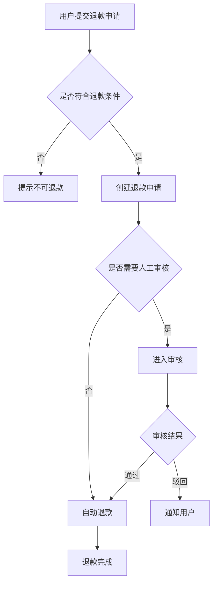
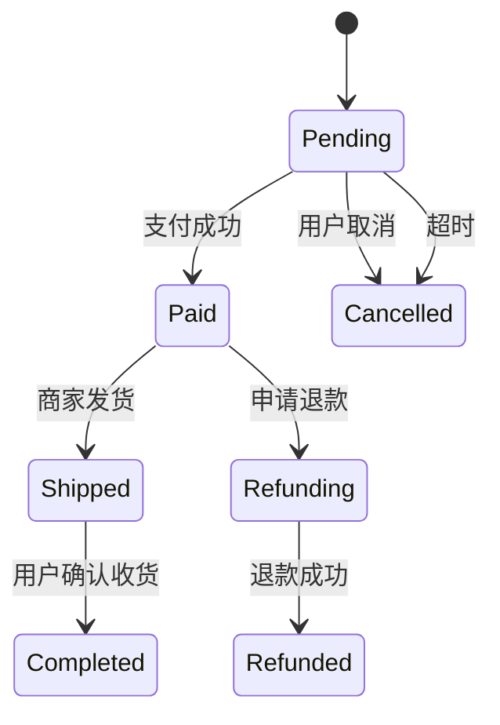

# 业务流程与详细功能设计

> Business Flow & Detailed Feature Design  
> Version: 1.0

---

# 1. 文档目的

本文档定义 AI 产品经理如何将已经明确的：

* 用户故事
* MVP 范围
* 产品能力
* 功能模块
* 核心业务对象

进一步转化为：

* 核心业务流程
* 主流程
* 分支流程
* 异常流程
* 边界场景
* 详细功能规则
* 状态机
* 权限规则
* 数据规则
* 系统反馈
* 验收标准

本阶段的核心目标是：

> **把“产品应该有什么功能”，进一步设计成“系统在各种真实条件下到底应该怎么运转”。**

前一阶段回答的是：

> What capabilities do we need?

本阶段进一步回答：

> How should the product behave?

这里的 How 指的是：

> 产品行为和业务逻辑。

不是：

* 数据库怎么建
* API 怎么设计
* 微服务怎么拆
* 技术框架怎么选

这些属于技术设计。

---

# 2. 前置条件

进入本阶段前，至少应具备：

* Primary User 已明确
* Core User Journey 已明确
* 关键 User Stories 已明确
* MVP Scope 已明确
* Capability Map 已形成
* Module Map 已形成
* Feature Tree 已形成
* 关键 Business Objects 已识别

如果仍然无法回答：

> 这个功能到底服务哪个用户故事？

则应返回：

> 用户故事与产品功能架构阶段。

---

# 3. 本阶段核心产物

建议形成：

1. Core Business Flow
2. Feature Specification
3. Business Rules
4. State Machine
5. Permission Matrix
6. Exception & Edge Case List
7. Acceptance Criteria
8. Open Questions

复杂项目还可以包含：

* Decision Table
* Sequence Flow
* Audit Requirements
* Notification Rules
* Retry / Idempotency Product Requirements

---

# 4. 业务流程设计的核心原则

业务流程不只是：

> 把正常路径画出来。

完整业务流程应该考虑：

```text
Happy Path
+
Alternative Flow
+
Exception Flow
+
Edge Case
```

如果只设计 Happy Path，研发和测试阶段几乎一定会出现大量临时补规则。

---

# 5. Happy Path

Happy Path 指：

> 用户在所有条件正常的情况下完成目标的主流程。

例如退款：

```text
用户打开订单
↓
点击申请退款
↓
填写退款原因
↓
提交申请
↓
系统创建退款申请
↓
商家审核
↓
审核通过
↓
系统退款
↓
退款完成
```

Happy Path 是主干。

但不是完整需求。

---

# 6. Alternative Flow

Alternative Flow 指：

> 合法且正常，但与主流程不同的路径。

例如支付：

主流程：

> 微信支付成功。

Alternative：

> 用户选择支付宝支付成功。

或者：

> 用户使用余额 + 第三方支付组合支付。

这些不是 Exception。

---

# 7. Exception Flow

Exception Flow 指：

> 流程执行过程中出现失败或异常情况。

例如：

* 支付失败
* 网络中断
* 库存不足
* 权限不足
* 审核驳回
* 第三方接口异常
* 文件上传失败

每个关键 Exception 至少回答：

```text
发生了什么？

系统状态是什么？

用户看到什么？

用户还能做什么？

是否可以重试？

是否需要通知？

是否需要记录？
```

---

# 8. Edge Case

Edge Case 指：

> 低频但合法或可能发生的边界情况。

例如：

* 用户重复点击提交
* 两个管理员同时修改同一数据
* 用户提交后立即被禁用
* 支付成功但前端超时
* 订单刚好在 23:59:59 过期
* 数据为空
* 文本超长
* 数量为 0
* 最大允许值
* 最小允许值

边界条件往往是 Bug 和线上事故的重要来源。

---

# 9. Trigger

每条业务流程必须明确 Trigger。

例如：

> 用户点击提交订单。

或者：

> 系统检测到订单 30 分钟未支付。

或者：

> 管理员审核申请。

不同 Trigger 可能对应不同 Actor。

---

# 10. Actor

Actor 可以包括：

* User
* Admin
* Operator
* Reviewer
* Merchant
* Buyer
* Seller
* System
* External System

不要假设所有流程都由用户触发。

系统本身也可以是 Actor。

---

# 11. Preconditions

流程开始前需要满足哪些条件？

例如：

```text
用户已登录
订单属于当前用户
订单状态 = 待支付
库存仍然有效
支付渠道可用
```

Preconditions 越清晰，后续权限和异常规则越容易定义。

---

# 12. Postconditions

流程结束后应该满足什么？

例如：

支付成功后：

```text
订单状态 = 已支付
支付记录存在
库存已扣减
用户收到成功反馈
必要通知已发送
```

---

# 13. 标准业务流程模板

```markdown
# Business Flow

## Flow ID

FLOW-001

## Flow Name

## Goal

## Actor

## Trigger

## Preconditions

## Main Flow

1.
2.
3.
4.

## Alternative Flow

### A1

### A2

## Exception Flow

### E1

### E2

## Edge Cases

## Postconditions

## Related Business Rules

## Related States

## Related Permissions

## Notifications

## Audit Requirements

## Open Questions
```

---

# 14. Mermaid 流程图

复杂流程推荐使用 Mermaid。

例如：



流程图用于帮助理解。

正式规则仍应以结构化文字为准。

---

# 15. 泳道图思维

当多个角色协作时，应使用泳道思维。

例如：

```text
用户          系统          审核员

提交申请
   ↓
            创建记录
               ↓
                         查看申请
                             ↓
                         审核通过
                             ↓
            更新状态
               ↓
收到通知
```

重点是明确：

> 谁在什么时候负责什么。

---

# 16. Business Rule

Business Rule 指：

> 系统在业务层必须遵守的明确规则。

例如：

```text
BR-001
订单创建后 30 分钟未支付，则自动关闭。

BR-002
已发货订单不允许用户直接取消。

BR-003
退款金额不得超过实际支付金额。
```

业务规则必须尽量：

* 明确
* 无歧义
* 可验证
* 可测试

---

# 17. Business Rule 标准格式

```markdown
## BR-001

### Rule

### Applies To

### Trigger

### Condition

### Result

### Exception

### Priority

### Source

### Notes
```

---

# 18. 避免模糊规则

不推荐：

> “一般情况下用户不能退款。”

需要明确：

> 什么情况下可以？

> 什么情况下不能？

例如：

```text
订单状态 = 已支付
AND 未发货
AND 支付时间距当前时间 ≤ 24 小时

→ 用户可申请无理由退款
```

---

# 19. Decision Table

当多个条件组合影响结果时，优先使用 Decision Table。

例如：

| 已支付 | 已发货 | 超过7天 | 是否允许退款 |
| --- | --- | ---- | ------ |
| 否   | 任意  | 任意   | 否      |
| 是   | 否   | 否    | 是      |
| 是   | 是   | 否    | 需审核    |
| 是   | 任意  | 是    | 否      |

比几十行自然语言更清晰。

---

# 20. 规则优先级

当业务规则可能冲突时，应明确优先级。

例如：

```text
法律/合规规则
>
安全规则
>
业务规则
>
用户偏好
```

如果没有优先级，容易出现规则冲突。

---

# 21. 规则来源

关键规则最好记录来源：

* 法律法规
* 商业政策
* 运营规则
* 合同
* 用户体验需求
* 风险控制
* 产品决策

这样未来规则变化时容易追溯。

---

# 22. State Machine

当业务对象存在生命周期时，应优先建立状态机。

适用对象例如：

* Order
* Payment
* Refund
* Task
* Project
* Ticket
* Review
* Application
* Subscription

---

# 23. 状态定义原则

每个状态应该表达：

> 业务对象当前真实处于什么阶段。

不要把：

> 页面显示状态

和：

> 业务状态

混为一谈。

---

# 24. 状态必须互斥且有意义

例如订单状态：

```text
Draft
Pending Payment
Paid
Shipped
Completed
Cancelled
Refunding
Refunded
```

应尽量避免含义重叠：

```text
处理中
进行中
操作中
等待中
```

这种状态很难理解。

---

# 25. State Transition

每次状态转换必须回答：

```text
From

Trigger

Actor

Precondition

To

Side Effect

Notification

Audit
```

---

# 26. 状态转换模板

| From    | Trigger     | Actor  | Condition     | To        | Side Effect           |
| ------- | ----------- | ------ | ------------- | --------- | --------------------- |
| Pending | Pay Success | System | Payment Valid | Paid      | Create payment record |
| Pending | Timeout     | System | >30 min       | Cancelled | Release inventory     |

---

# 27. 状态机图



---

# 28. Forbidden Transition

必须明确哪些状态不能转换。

例如：

```text
Completed → Pending Payment
```

通常属于非法转换。

系统应：

* 拒绝
* 提示
* 记录必要日志

---

# 29. Terminal State

明确终态。

例如：

* Completed
* Cancelled
* Refunded

终态是否允许再次操作，也要说明。

---

# 30. 状态回退

状态是否允许回退，应明确。

例如：

```text
审核通过
→ 是否允许撤销审核？
```

如果允许：

* 谁可以撤销？
* 什么时间内？
* 是否需要原因？
* 是否需要记录审计？

---

# 31. 状态与权限联动

权限往往与状态相关。

例如：

```text
Draft：
创建人可编辑

Submitted：
创建人不可编辑

Rejected：
创建人可修改后重新提交

Approved：
仅管理员可撤销
```

---

# 32. Permission Model

权限设计至少考虑：

```text
Who
can do
What
to Which Resource
under What Condition
```

---

# 33. 权限四个基本维度

## Subject

谁：

* User
* Role
* Team
* Department

## Resource

操作什么：

* Order
* Project
* File
* User

## Action

做什么：

* View
* Create
* Edit
* Delete
* Approve
* Export

## Condition

在什么条件下：

* 自己创建
* 所属团队
* 当前状态
* 时间范围

---

# 34. RBAC

常见 Role-Based Access Control：

```text
User
→ Role
→ Permission
```

例如：

```text
普通员工
→ 查看、编辑自己任务

主管
→ 查看团队任务

管理员
→ 管理全局配置
```

---

# 35. 资源级权限

复杂产品不要只停留在菜单权限。

例如：

> 用户有“查看订单”的权限。

还要判断：

> 可以查看谁的订单？

可能是：

```text
Own
Team
Department
All
```

---

# 36. Action-Level Permission

不要只写：

> 管理订单。

应拆：

* View
* Create
* Edit
* Cancel
* Refund
* Export

不同操作风险不同。

---

# 37. Permission Matrix

| Role     | Resource     | View | Create | Edit | Delete | Approve |
| -------- | ------------ | ---: | -----: | ---: | -----: | ------: |
| User     | Own Request  |    ✓ |      ✓ | 条件允许 |      × |       × |
| Reviewer | Team Request |    ✓ |      × |    × |      × |       ✓ |
| Admin    | All          |    ✓ |      ✓ |    ✓ |      ✓ |       ✓ |

---

# 38. 权限失败行为

权限不足时必须明确：

* 隐藏入口？
* 展示但 Disable？
* 点击后提示？
* 返回无权限页面？

不同场景可以不同。

安全规则上：

> 前端隐藏不等于权限控制。

产品需求需要明确服务端也应执行权限校验，但不需要设计具体实现。

---

# 39. 数据规则

Detailed Feature Design 需要定义产品层的数据规则。

例如：

* 必填
* 可选
* 默认值
* 唯一性
* 最大长度
* 最小长度
* 允许范围
* 业务校验
* 展示精度
* 时间规则

---

# 40. 字段规则模板

| Field  | Required | Default | Validation | Editable    | Visibility |
| ------ | -------- | ------- | ---------- | ----------- | ---------- |
| Name   | Yes      | -       | 1-50 chars | Yes         | All        |
| Status | System   | Draft   | Enum       | Conditional | All        |

这里描述产品要求。

不是数据库 Schema。

---

# 41. 输入校验

需要考虑：

* 空值
* 超长
* 非法字符
* 格式错误
* 重复
* 边界值
* 过期值

例如金额：

```text
必须 > 0
最多 2 位小数
不得超过可退款余额
```

---

# 42. 时间规则

时间是业务 Bug 高频来源。

需要明确：

* 使用哪个时区
* 起止时间是否包含
* 到期时间
* 跨天
* 跨月
* 节假日
* 夏令时（国际产品）

例如：

> 优惠券有效至 2026-08-31 23:59:59，北京时间。

比：

> “8 月底过期”

更明确。

---

# 43. 金额规则

涉及金额时应明确：

* 币种
* 精度
* 四舍五入规则
* 税前/税后
* 优惠计算顺序
* 上限
* 下限

避免出现：

> 前端算 99.99，后端算 100.00。

---

# 44. 数量与库存规则

例如：

```text
购买数量必须 ≥ 1

不得超过可售库存

下单是否锁库存

锁多久

超时如何释放
```

即使技术实现由研发决定，业务行为必须由产品明确。

---

# 45. 重复提交

关键动作必须考虑：

> 用户连续点击两次怎么办？

例如：

* 创建订单
* 支付
* 提交审核
* 退款
* 发放优惠券

产品要求通常应是：

> 同一业务操作不得产生重复结果。

---

# 46. 幂等产品要求

产品层可以写：

> 对同一订单重复执行“确认付款”，系统不得重复生成支付结果。

不需要规定具体技术 Token 或数据库实现。

---

# 47. 并发场景

高风险功能主动考虑：

> 两个人同时操作怎么办？

例如：

```text
两位管理员同时审核同一申请。

两个用户同时购买最后一个库存。

用户和客服同时修改订单。
```

需要明确最终业务结果。

---

# 48. 并发决策原则

产品至少要明确：

* 谁成功？
* 谁失败？
* 后操作是否覆盖？
* 是否提示数据已变化？
* 是否要求刷新？

---

# 49. 数据新鲜度

某些页面展示实时数据，某些允许延迟。

例如：

```text
库存：
要求近实时

运营报表：
允许 T+1

AI 分析：
允许数分钟延迟
```

产品需求应根据场景定义期望。

---

# 50. Soft Delete / Delete

“删除”必须明确到底是什么：

* 永久删除
* 软删除
* 移入回收站
* 仅用户不可见
* 仅取消关联

以及：

* 能否恢复？
* 保留多久？
* 谁可以恢复？

---

# 51. Undo

高风险操作应考虑 Undo。

例如：

* 删除
* 批量修改
* 撤回
* 移动

如果不可恢复，应加强确认机制。

---

# 52. Confirmation

不是所有按钮都需要二次确认。

通常以下场景优先考虑：

* 不可逆操作
* 高金额
* 高风险
* 影响他人
* 批量操作
* 删除

---

# 53. Notification

业务事件发生后，是否需要通知？

定义：

```text
Event
Recipient
Channel
Trigger
Content Goal
Timing
Deduplication
```

---

# 54. Notification Matrix

| Event | Recipient | Channel | Timing | Mandatory |
| ----- | --------- | ------- | ------ | --------- |
| 审核通过  | 申请人       | 站内信     | 立即     | Yes       |
| 支付失败  | 用户        | 页面提示    | 立即     | Yes       |
| 周报生成  | 管理员       | 邮件      | 完成后    | Optional  |

---

# 55. 通知不是业务状态

不要把：

> “已通知”

混进订单状态。

通知通常是业务事件的 Side Effect。

---

# 56. Audit Log

以下场景应考虑审计：

* 权限修改
* 金额修改
* 审核
* 删除
* 风控
* 退款
* 配置修改

审计至少可能需要：

```text
谁

什么时候

操作了什么

修改前

修改后

原因
```

---

# 57. Feature Goal

详细设计每个 Feature 前，先说明：

> 这个功能为什么存在？

示例：

> 帮助运营人员快速筛选高风险订单，提高人工审核效率。

避免直接开始写页面字段。

---

# 58. Feature Actor

明确主要使用者。

例如：

* Buyer
* Seller
* Operator
* Admin
* System

多角色则分别说明。

---

# 59. Feature Trigger

功能如何开始？

例如：

* 用户主动进入
* 系统自动触发
* 外部事件触发
* 上一流程结束触发

---

# 60. Feature Preconditions

例如：

```text
用户已登录

用户拥有审核权限

申请状态 = Pending Review
```

---

# 61. Main Flow

Main Flow 应：

* 顺序明确
* 每一步有 Actor
* 每一步有系统行为
* 必要时说明状态变化

---

# 62. Alternative Flow

例如：

```text
A1 用户保存草稿

A2 用户使用已有模板创建

A3 用户从历史订单复制
```

---

# 63. Exception Flow

每个关键异常建议编号。

例如：

```text
E1 权限失效

E2 数据被其他用户修改

E3 第三方服务失败

E4 网络超时
```

---

# 64. UI Feedback

系统行为发生后，用户应该知道：

> 发生了什么。

典型反馈：

* Toast
* Inline Error
* Dialog
* Status Change
* Progress
* Banner
* Notification

Detailed Feature Design 不必规定视觉样式，但要规定反馈语义。

---

# 65. Loading State

耗时操作考虑：

* 是否 Loading
* 是否可以关闭页面
* 是否可以取消
* 是否异步完成
* 完成后如何通知

---

# 66. Empty State

数据为空时不能简单：

> 空白。

需要判断：

* 真正没有数据
* 用户没有权限
* 搜索无结果
* 系统加载失败

这四者不能混淆。

---

# 67. Error State

错误至少区分：

* 用户输入错误
* 权限错误
* 业务规则错误
* 系统错误
* 网络错误
* 第三方错误

不同错误给用户的下一步应该不同。

---

# 68. Retry

失败后是否允许重试？

例如：

```text
文件上传失败 → 可以重试

付款结果未知 → 不应简单再次支付

批量任务失败 → 是否支持只重试失败项
```

---

# 69. Partial Success

批量功能经常出现：

> 10 条成功，2 条失败。

必须定义：

* 整体是否算成功
* 如何展示失败项
* 是否支持重试失败项
* 是否允许导出失败原因

---

# 70. Batch Operation

批量操作至少考虑：

* 最大数量
* 是否跨页选择
* 是否支持全选
* 部分失败
* 权限不同
* 执行时间
* 是否可撤销

---

# 71. Search

搜索功能需要明确：

* 搜索范围
* 精确 / 模糊
* 大小写
* 多关键词
* 空搜索
* 无结果
* 权限过滤

不要只写：

> 支持搜索。

---

# 72. Filter

筛选应明确：

* 条件类型
* 单选/多选
* 默认值
* 条件组合逻辑
* 清空方式
* 是否记忆条件

---

# 73. Sort

排序应明确：

* 默认排序
* 支持字段
* 升序/降序
* 空值位置
* 相同值时次级排序

---

# 74. Pagination

如果产品场景涉及大量数据，需要定义：

* 分页还是无限滚动
* 默认数量
* 最大数量
* 筛选后是否回第一页

具体性能实现由技术团队决定。

---

# 75. Import

导入功能至少考虑：

* 支持格式
* 模板
* 最大文件
* 数据校验
* 重复数据
* 部分失败
* 错误报告
* 是否支持撤销

---

# 76. Export

导出功能至少考虑：

* 谁可以导出
* 导出范围
* 当前筛选还是全部
* 最大规模
* 文件格式
* 敏感字段
* 是否异步
* 是否审计

---

# 77. File Upload

考虑：

* 类型
* 大小
* 数量
* 重名
* 上传失败
* 删除
* 下载
* 权限
* 安全扫描需求

---

# 78. Sensitive Data

涉及：

* 手机号
* 身份证
* 地址
* 财务信息
* 私密聊天
* 企业机密

应明确：

* 谁可见
* 是否脱敏
* 是否可导出
* 是否需要操作日志

---

# 79. Feature Specification 标准模板

```markdown
# Feature Specification

## 1. Feature ID

FEAT-001

## 2. Feature Name

## 3. Goal

## 4. Related User Story

## 5. Actor

## 6. Scenario

## 7. Trigger

## 8. Preconditions

## 9. Main Flow

## 10. Alternative Flow

## 11. Business Rules

## 12. Data Rules

## 13. Permission

## 14. State Transition

## 15. Exception Flow

## 16. Edge Cases

## 17. UI Feedback

## 18. Loading / Empty / Error States

## 19. Notification

## 20. Audit

## 21. Analytics

## 22. Acceptance Criteria

## 23. Dependencies

## 24. Risks

## 25. Open Questions
```

---

# 80. Acceptance Criteria

Acceptance Criteria 必须：

* 明确
* 可观察
* 可测试
* 不依赖个人理解

---

# 81. Given / When / Then

推荐：

```text
Given
前置条件

When
用户执行某行为

Then
系统应产生明确结果
```

---

# 82. Acceptance Criteria 示例

```text
Given
用户已登录，订单状态为“待支付”

When
用户点击“取消订单”并确认

Then
订单状态变更为“已取消”
AND
订单不可再次支付
AND
已锁定库存被释放
AND
页面显示取消成功
```

---

# 83. Negative Acceptance Criteria

不仅测试成功情况。

例如：

```text
Given
订单状态 = 已发货

When
用户尝试取消订单

Then
系统拒绝取消
AND
订单状态保持不变
AND
提示“订单已发货，无法直接取消”
```

---

# 84. Boundary Acceptance Criteria

例如：

```text
Given
最大上传文件限制 = 10MB

When
上传 10MB 文件

Then
允许上传

When
上传 10.01MB 文件

Then
拒绝上传
```

---

# 85. Analytics

关键 Feature 应考虑：

> 上线后如何知道它有没有被使用、有没有产生价值？

例如事件：

```text
feature_view

feature_start

feature_success

feature_fail

feature_cancel
```

详细埋点定义可以在 PRD 或数据文档中进一步完善。

---

# 86. 产品指标与行为事件区分

事件：

> 点击“生成回复”。

指标：

> AI 回复采纳率。

不要混为一谈。

---

# 87. NFR 提醒

虽然详细非功能需求会在 PRD 中进一步整理，但本阶段如果业务强依赖，应提前识别：

* 响应速度
* 可用性
* 数据一致性
* 安全
* 隐私
* 可访问性
* 容量
* 国际化

例如：

> 支付结果必须具有高一致性。

这是业务关键约束。

---

# 88. 外部系统依赖

涉及外部系统时明确：

```text
依赖什么

为什么依赖

失败怎么办

超时怎么办

是否有替代路径
```

---

# 89. Third-Party Failure

例如短信服务失败：

需要判断：

> 主业务是否失败？

如果只是通知失败：

> 业务可能仍然成功。

不要让非核心 Side Effect 阻塞核心业务。

---

# 90. Graceful Degradation

重要系统应考虑降级。

例如：

> 推荐服务不可用时，展示默认列表。

> AI 功能失败时，允许用户手动输入。

产品经理需要定义：

> 核心价值的最低可用体验。

---

# 91. Fallback

Fallback 指：

> 主方案不可用时使用的替代路径。

例如：

```text
AI 自动分类失败
↓
进入人工分类
```

Fallback 要明确：

* 何时触发
* 用户是否知道
* 是否影响最终结果
* 是否需要恢复

---

# 92. Feature Boundary

每个 Feature 最好明确：

> 它负责什么。

以及：

> 它不负责什么。

防止功能不断吞并其他职责。

---

# 93. 复杂功能拆分

当 Feature 出现：

* 多角色
* 多状态
* 多个业务对象
* 大量规则
* 大量异常

应考虑拆为多个子 Feature。

---

# 94. 不要按页面机械拆 Feature

例如：

```text
订单列表页
订单详情页
```

更适合视为：

> 页面。

Feature 可能是：

* 订单查询
* 订单取消
* 订单退款

页面只是承载这些能力。

---

# 95. Red Flag：规则过多

如果一个简单功能出现几十条复杂规则，可能意味着：

* 需求本身有问题
* 模块边界不对
* 历史规则堆积
* 产品正在过度设计

应返回上层重新检查。

---

# 96. Red Flag：大量 Exception

如果 Exception 比 Main Flow 还复杂：

> 可能核心流程设计不合理。

不要只继续补补丁。

---

# 97. Red Flag：状态爆炸

例如：

```text
12 个主状态
×
8 个子状态
×
多个标签
```

需要重新判断：

> 是否把不同维度错误塞进同一个状态字段。

产品层应尽量让状态语义清晰。

---

# 98. Red Flag：权限爆炸

如果出现几十个角色，每个角色几十个特例：

> 应重新评估角色模型和资源边界。

---

# 99. AI 产品经理的异常追问

对每个关键流程主动问：

```text
如果失败怎么办？

如果重复怎么办？

如果超时怎么办？

如果数据变化怎么办？

如果用户没权限怎么办？

如果第三方服务挂了怎么办？

如果只有一半成功怎么办？

如果两个用户同时操作怎么办？
```

---

# 100. AI 产品经理的状态追问

对核心 Business Object 问：

```text
它从哪里开始？

有哪些状态？

什么事件改变状态？

谁能改变？

哪些转换禁止？

哪些状态是终态？

失败后去哪？

是否允许回退？
```

---

# 101. AI 产品经理的权限追问

```text
谁能看？

谁能创建？

谁能修改？

谁能删除？

谁能审核？

能操作所有数据还是自己的？

不同状态下权限是否变化？
```

---

# 102. AI 产品经理的规则追问

```text
这个规则具体条件是什么？

边界值是多少？

如果两个规则冲突怎么办？

规则来源是什么？

规则以后是否可能配置化？
```

---

# 103. 避免过度设计原则

不是每个功能都必须有：

* 状态机
* 权限矩阵
* 审计日志
* 幂等说明
* 并发规则

只有：

> 与业务风险和复杂度相匹配。

例如普通“修改昵称”不需要设计成银行级流程。

---

# 104. 风险驱动详细度

功能越接近以下场景，设计越应严谨：

```text
金额
权限
删除
隐私
合同
支付
审核
库存
安全
不可逆操作
跨系统
高并发
```

---

# 105. 简单 Feature 可以简化

例如：

> 用户修改个人签名。

可以只包含：

* Goal
* Preconditions
* Input Rules
* Main Flow
* Error
* Acceptance Criteria

不必机械填满 25 个章节。

---

# 106. 核心 Feature 必须完整

对于核心业务流程，应至少明确：

* Actor
* Preconditions
* Main Flow
* Business Rules
* Data Rules
* State
* Permission
* Exception
* Edge Cases
* Acceptance Criteria

---

# 107. Traceability

保持：

```text
Requirement
↓
User Story
↓
Feature
↓
Business Rule
↓
Acceptance Criteria
```

这样测试问题出现时，可以快速追溯。

---

# 108. Rule Traceability

业务规则可以编号：

```text
BR-001
BR-002
BR-003
```

Feature Specification 中引用：

> Related Rules: BR-001, BR-006

Acceptance Criteria 也可以对应规则。

---

# 109. Open Question

如果规则无法确认：

不要自行补全。

标记：

```text
OQ-003

Question:
退款超过 7 天是否允许人工特批？

Why It Matters:
影响退款状态机和客服权限。

Blocking:
Yes
```

---

# 110. Blocking Question

影响以下内容的 Open Question 通常属于 Blocking：

* 核心业务逻辑
* 状态
* 金额
* 权限
* MVP Scope
* 法规
* 数据一致性

研发前应优先解决。

---

# 111. Product Decision

当多个方案都合理但必须选一个时，形成 Product Decision。

```text
Decision:
订单取消后库存立即释放。

Reason:
避免库存无效占用。

Impact:
取消后的订单不可恢复。
```

---

# 112. 详细功能设计检查

完成 Feature 后检查：

## Goal

* [ ] Feature 为什么存在清晰

## Actor

* [ ] 主要 Actor 明确

## Flow

* [ ] Main Flow 完整
* [ ] Alternative Flow 已考虑

## Rules

* [ ] Business Rules 明确
* [ ] Data Rules 明确

## State

* [ ] 需要状态机的对象已有状态设计
* [ ] State Transition 清晰

## Permission

* [ ] 操作权限明确
* [ ] 数据范围权限明确

## Exception

* [ ] 主要失败场景已考虑
* [ ] 重复提交已考虑
* [ ] 并发风险按需要考虑

## UI

* [ ] Success / Error Feedback 明确
* [ ] Loading / Empty 按需要覆盖

## QA

* [ ] Acceptance Criteria 可测试

---

# 113. Business Flow Gate

进入详细功能设计前检查：

* [ ] Trigger 清楚
* [ ] Actor 清楚
* [ ] Preconditions 清楚
* [ ] Happy Path 闭环
* [ ] Alternative Flow 基本完整
* [ ] Exception Flow 基本完整
* [ ] Postconditions 清楚
* [ ] 核心状态变化清楚

满足：

> READY FOR FEATURE DESIGN

---

# 114. Feature Design Gate

进入交互与低保真原型前检查：

## Feature

* [ ] 核心功能范围明确

## Rules

* [ ] Business Rules 明确
* [ ] Data Rules 明确

## State

* [ ] 核心状态机明确

## Permission

* [ ] 权限边界明确

## Failure

* [ ] Exception Flow 已覆盖
* [ ] Edge Cases 基本覆盖

## Feedback

* [ ] 用户反馈语义明确

## QA

* [ ] Acceptance Criteria 可测试

## Risk

* [ ] 无未处理的重大 Blocking Question

满足：

> READY FOR UX & WIREFRAME

否则：

> CONTINUE BUSINESS / FEATURE DESIGN

---

# 115. 阶段输出建议

完成本阶段后建议总结：

```text
Current Phase

Core Business Flows

Feature Specifications

Business Rules

State Machines

Permission Matrix

Data Rules

Exception Flows

Edge Cases

Notifications

Audit Requirements

Acceptance Criteria

Risks

Open Questions

Gate Result

Next
```

---

# 116. 最终工作原则

业务流程设计的价值不是：

> 画一张看起来很专业的流程图。

而是：

> **明确业务从开始到结束，在各种正常和异常条件下到底如何运行。**

详细功能设计的价值不是：

> 写更多文字。

而是：

> **消除产品、设计、前端、后端和 QA 对同一个需求的不同理解。**

始终牢记：

> Happy Path 只是开始，不是结束。

> 每一个重要业务对象都应该理解它的生命周期。

> 每一个高风险操作都应该理解它的权限和失败行为。

> 每一个复杂规则都应该尽可能写成可判断、可测试的条件。

> 页面设计不能替代业务逻辑设计。

> 技术实现不能替代产品规则定义。

最终目标是让一个核心 Feature 达到：

```text
Why 清楚
↓
Who 清楚
↓
When 清楚
↓
Flow 清楚
↓
Rule 清楚
↓
State 清楚
↓
Permission 清楚
↓
Failure 清楚
↓
Acceptance 清楚
```

达到这个程度后，后续交互原型和 PRD 才是在“表达已经想清楚的产品”，而不是一边画页面、一边临时补业务规则。
