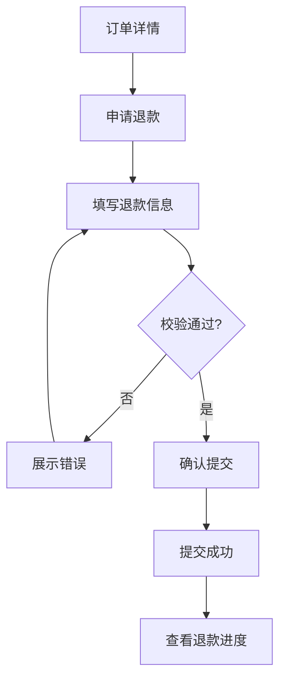
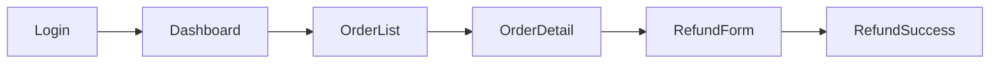

# 交互设计与低保真原型

> UX Interaction Design & Low-Fidelity Wireframe  
> Version: 1.0

---

# 1. 文档目的

本文档定义 AI 产品经理如何将已经确认的：

* 用户目标
* 用户故事
* 核心业务流程
* 功能规则
* 状态机
* 权限规则
* 异常处理
* MVP 范围

进一步转化为：

* 信息架构
* 页面清单
* 导航结构
* 用户操作路径
* 页面结构
* 页面状态
* 关键交互规则
* 低保真原型
* 页面间跳转关系

本阶段主要解决两个问题：

1. **用户如何理解和找到产品中的功能与信息？**
2. **用户如何通过页面和交互顺利完成核心任务？**

本阶段不是视觉设计阶段。

重点关注：

> 信息是否清晰、操作是否顺畅、反馈是否及时、状态是否完整、流程是否闭环。

---

# 2. 前置条件

进入本阶段前，应至少具备：

* Core User Journey 已明确
* MVP Scope 已明确
* Feature Tree 已形成
* Core Business Flow 已明确
* Business Rules 已明确
* State Machine 已明确
* Permission 已明确
* Exception Flow 已明确
* Acceptance Criteria 已基本形成

如果业务逻辑仍存在大量 Blocking Question，不应急于画原型。

---

# 3. 核心工作顺序

推荐遵循：

```text
Information Architecture
↓
Page Inventory
↓
Navigation
↓
User Flow
↓
Page Structure
↓
Wireframe
↓
Interaction Rules
↓
Page States
↓
UX Review
```

不要一上来直接画页面。

---

# 4. UX 设计的核心原则

## 4.1 Task First

页面首先服务用户任务。

不是为了“页面丰富”而设计页面。

每个核心页面都应能回答：

> 用户来到这里要完成什么？

---

## 4.2 Flow Before Screen

先设计完整任务路径。

再决定需要哪些页面。

不要：

```text
先画 20 个页面
↓
再尝试把它们连起来
```

应该：

```text
先明确任务流程
↓
判断需要哪些交互节点
↓
形成页面
```

---

## 4.3 Reduce Cognitive Load

减少用户需要：

* 记忆
* 推理
* 猜测
* 切换
* 重复输入

的信息和操作。

---

## 4.4 Feedback Matters

用户执行操作后必须知道：

> 系统发生了什么。

包括：

* 是否成功
* 是否失败
* 是否处理中
* 是否需要等待
* 是否还能继续操作

---

## 4.5 Consistency

相同语义应尽量保持：

* 相同词汇
* 相同交互方式
* 相同位置
* 相同反馈逻辑

---

# 5. 信息架构

Information Architecture 关注：

> 信息和功能应该如何组织，用户才能理解和找到。

包括：

* 内容分组
* 页面层级
* 功能归属
* 导航结构
* 信息优先级

---

# 6. 信息架构不等于功能架构

功能架构：

> 产品具备什么能力。

信息架构：

> 这些能力如何被用户找到和理解。

例如：

功能能力：

```text
订单查询
订单取消
订单退款
```

信息架构可能表现为：

```text
我的订单
└── 订单详情
    ├── 取消订单
    └── 申请退款
```

---

# 7. 信息架构设计原则

## 7.1 用户心智模型优先

分组尽量符合用户对业务的理解。

不要完全按照：

* 技术服务
* 数据库表
* 内部组织结构

来命名。

---

## 7.2 核心任务优先

高频、高价值任务应更容易到达。

---

## 7.3 层级不要过深

避免：

```text
一级
→ 二级
→ 三级
→ 四级
→ 五级
```

用户为了完成普通操作需要不断钻取。

---

## 7.4 名称可理解

避免只有内部团队理解的术语。

例如：

不推荐：

> Resource Object Management

如果用户实际理解为：

> 文件管理

优先使用用户语言。

---

# 8. Page Inventory

完成信息架构后建立页面清单。

建议字段：

| Page ID | Page Name | Actor | Goal | Entry | Exit | Priority |
| ------- | --------- | ----- | ---- | ----- | ---- | -------- |

---

# 9. Page Goal

每个页面必须定义：

> 用户在这里最主要要完成什么？

例如：

```text
Page:
订单详情

Primary Goal:
理解当前订单状态并完成下一步操作
```

而不是：

> 展示订单信息。

---

# 10. 页面类型

常见：

## Dashboard

用于概览和监控。

## List

用于浏览大量对象。

## Detail

查看一个对象完整信息。

## Form

创建或编辑。

## Wizard

多步骤任务。

## Workspace

复杂操作场景。

## Settings

配置。

## Confirmation / Result

确认或结果反馈。

---

# 11. 页面不要一功能一个

不要机械：

```text
新增页
编辑页
查看页
删除页
```

需要判断：

> 是否可以通过同一页面完成？

例如新增和编辑可能共用 Form。

---

# 12. Navigation

导航回答：

> 用户如何在产品结构中移动？

常见：

* Global Navigation
* Local Navigation
* Tab
* Breadcrumb
* Sidebar
* Bottom Navigation
* Contextual Entry
* Deep Link

---

# 13. 全局导航

适合：

> 高频、稳定、一级产品区域。

不要把所有功能都塞进一级导航。

---

# 14. Contextual Navigation

某些操作只有在特定上下文中才合理。

例如：

> 申请退款

通常应该出现在：

> 订单详情

而不是全局导航。

---

# 15. 导航优先级

判断：

* 高频吗？
* 核心吗？
* 用户是否需要随时访问？
* 是否依赖上下文？

再决定入口层级。

---

# 16. User Flow

User Flow 表示：

> 用户为了完成一个目标，需要经过哪些操作节点。

标准结构：

```text
Entry
↓
Action
↓
Decision
↓
System Feedback
↓
Next Action
↓
Outcome
```

---

# 17. User Flow 必须基于业务流程

业务流程关注：

> 业务如何运转。

User Flow 关注：

> 用户如何参与这套业务。

二者相关但不完全相同。

---

# 18. User Flow 示例

例如退款：

```text
订单详情
↓
点击申请退款
↓
填写退款信息
↓
系统校验
↓
确认提交
↓
提交成功
↓
查看退款进度
```

如果失败：

```text
系统校验失败
↓
页面展示原因
↓
用户修改
↓
重新提交
```

---

# 19. Mermaid User Flow



---

# 20. 页面结构

每个页面都可以拆解为：

```text
Page
├── Header
├── Primary Information
├── Primary Action
├── Secondary Information
├── Secondary Action
├── Status / Feedback
└── Supporting Content
```

页面布局的核心不是“摆组件”。

而是：

> 建立信息和操作优先级。

---

# 21. 信息优先级

优先级一般遵循：

```text
用户当前任务
>
当前状态
>
关键数据
>
下一步操作
>
辅助信息
```

---

# 22. Primary Action

每个页面尽量明确：

> 最重要的下一步动作是什么？

例如：

订单待支付：

> Primary Action = 去支付

而不是同时给：

```text
支付
分享
联系客服
修改备注
导出
打印
```

全部相同视觉权重。

---

# 23. Secondary Action

次级操作可以降低视觉优先级。

例如：

* 编辑备注
* 分享
* 查看帮助
* 导出

---

# 24. Dangerous Action

高风险操作需要明显区分。

例如：

* 删除
* 注销
* 退款
* 撤销
* 清空

不能与普通操作完全同等处理。

---

# 25. Progressive Disclosure

复杂信息不要一次全部展示。

可以采用：

* 折叠
* 更多
* 分步
* Advanced Settings
* 二级页面

让用户先看到当前最重要的信息。

---

# 26. 表单设计

Form 是高频出错区域。

应考虑：

* 字段顺序
* 必填
* 默认值
* 输入提示
* 校验
* 错误提示
* 提交反馈

---

# 27. 字段顺序

按用户思考顺序组织。

不要按数据库字段顺序。

---

# 28. Default Value

合理默认值可以减少操作。

例如：

> 时间范围默认最近 7 天。

但默认值不能偷偷改变重大用户决策。

---

# 29. Validation Timing

校验可以发生在：

* 输入时
* 失焦时
* 提交时

不同场景选择不同策略。

---

# 30. Inline Validation

对于：

* 格式错误
* 长度错误
* 必填

适合尽早反馈。

---

# 31. Business Validation

例如：

> 退款金额不能超过可退款余额。

通常需要业务数据参与。

提示必须说明：

> 为什么失败。

---

# 32. 错误提示原则

错误提示至少回答：

```text
发生了什么

为什么

用户怎么修复
```

不推荐：

> Error 10023。

推荐：

> 退款金额超过当前可退款余额，请修改金额后重新提交。

---

# 33. 空状态

Empty State 应区分：

## First Use Empty

用户从未创建任何数据。

## Search Empty

搜索无结果。

## Filter Empty

筛选条件下无结果。

## Permission Empty

没有权限。

## Error Empty

加载失败。

---

# 34. First Use Empty

适合提供：

* 解释
* 示例
* Primary Action

例如：

> 还没有项目，创建第一个项目开始协作。

---

# 35. Search Empty

应帮助用户：

* 修改关键词
* 清除筛选
* 返回全部结果

---

# 36. Loading

加载状态至少判断：

* 是局部加载还是全页加载
* 是否应该显示 Skeleton
* 是否允许继续操作
* 是否需要 Progress

---

# 37. Long-running Task

例如：

* AI 生成
* 视频处理
* 批量导入
* 大规模导出

需要考虑：

```text
任务已开始
↓
处理中
↓
完成 / 失败
```

用户是否必须停留页面，应明确。

---

# 38. Progress

如果耗时明显，应尽可能提供：

* 处理中
* 进度
* 预计阶段
* 完成通知

不要让用户猜系统是否卡死。

---

# 39. Success State

成功后应明确：

* 成功了什么
* 当前状态
* 下一步是什么

例如：

> 退款申请已提交，预计 1～3 个工作日完成审核。

---

# 40. Error State

需要判断：

* 是否可恢复
* 是否可重试
* 用户需要做什么
* 是否保留已输入内容

---

# 41. Disabled State

按钮 Disable 时，用户最好能够理解：

> 为什么当前不可操作。

不能长期显示一个灰色按钮，却不告诉原因。

---

# 42. No Permission State

无权限时应明确：

* 是否隐藏入口
* 是否展示但不可操作
* 是否提示申请权限
* 是否显示联系人

具体策略根据业务风险决定。

---

# 43. Page State Matrix

核心页面建议维护：

| State         | Trigger | UI      | Action |
| ------------- | ------- | ------- | ------ |
| Default       | 正常进入    | 正常内容    | 正常操作   |
| Loading       | 请求中     | Loading | 等待     |
| Empty         | 无数据     | 空状态     | 创建/返回  |
| Error         | 加载失败    | 错误提示    | 重试     |
| No Permission | 权限不足    | 权限提示    | 申请权限   |

---

# 44. 页面状态不是可选项

如果设计稿只有：

> “有数据且一切正常”的页面

说明交互设计不完整。

---

# 45. Confirmation

确认弹窗仅用于真正需要二次确认的操作。

例如：

* 删除
* 不可逆操作
* 高金额
* 批量影响
* 退出未保存

---

# 46. 避免确认疲劳

如果每个操作都：

> “确定吗？”

用户会习惯性点击确认。

确认机制就失去意义。

---

# 47. Undo 优于 Confirmation

如果操作容易恢复，可以考虑：

> 先执行 + 提供 Undo。

例如：

> 删除一条非关键记录。

比层层确认更高效。

---

# 48. Modal

Modal 适合：

* 短任务
* 强上下文操作
* 快速确认

不适合：

* 长表单
* 复杂流程
* 多层嵌套

---

# 49. Drawer

适合：

* 侧边查看详情
* 快速编辑
* 保持列表上下文

但复杂操作不应无限塞进 Drawer。

---

# 50. Wizard

复杂任务适合多步骤向导。

例如：

```text
Step 1 基础信息
↓
Step 2 配置
↓
Step 3 确认
↓
完成
```

适合：

* 配置复杂
* 信息量大
* 用户需要逐步理解

---

# 51. Wizard 设计原则

每一步应该：

* 目标清晰
* 信息量可控
* 可返回
* 尽量保留输入
* 最后可检查

---

# 52. Save Draft

复杂表单要判断：

> 是否需要草稿。

特别适合：

* 时间较长
* 输入较多
* 多人协作
* 用户可能中途离开

---

# 53. Unsaved Changes

如果用户修改但未保存后离开，需要判断：

* 自动保存
* 提醒
* 丢弃
* 保存草稿

---

# 54. Autosave

适合：

* 文档
* 长文本
* 编辑器
* 配置较多场景

但需要明确：

> 保存状态。

例如：

```text
保存中...
已保存
保存失败
```

---

# 55. Search UX

搜索交互应考虑：

* 输入时搜索还是提交搜索
* 搜索建议
* 最近搜索
* 搜索历史
* Clear
* No Result
* Loading

---

# 56. Filter UX

多筛选条件时，用户应知道：

> 当前到底用了哪些筛选。

可以显示：

* Filter Chips
* 已选数量
* 清除全部

---

# 57. Sort UX

排序状态要可见。

例如：

> 创建时间 ↓

避免用户不知道当前结果为什么这样排列。

---

# 58. Table UX

B 端产品常见表格。

至少考虑：

* 列优先级
* 列宽
* 固定列
* 批量操作
* 空状态
* 排序
* 筛选
* 分页
* 行操作

---

# 59. Row Action

如果每行操作很多，不要全部平铺。

可以：

* Primary Action
* More Menu

但高频操作不应藏得过深。

---

# 60. Detail Page

详情页应重点表达：

```text
当前对象是什么
↓
当前状态是什么
↓
最重要信息是什么
↓
用户下一步能做什么
↓
历史发生了什么
```

---

# 61. Status Visualization

状态应：

* 清晰
* 可识别
* 与业务状态一致

不要只依赖颜色表达。

例如：

> 已支付

应该有文字，而不仅是绿色。

---

# 62. Timeline

有明显生命周期的对象可使用 Timeline。

例如：

```text
创建
↓
提交审核
↓
审核通过
↓
已完成
```

帮助用户理解过程。

---

# 63. Interaction Rule

关键交互需要明确规则。

例如：

```text
点击“生成回复”

1. 按钮进入 Loading
2. 禁止重复点击
3. 生成成功后展示候选回复
4. 生成失败保留原输入
5. 用户可重试
```

---

# 64. Interaction Rule Template

```markdown
## Interaction ID

INT-001

## Trigger

## Preconditions

## User Action

## System Response

## Loading

## Success

## Failure

## Disabled Condition

## Next Step
```

---

# 65. Hover / Focus / Selected

复杂 Web 产品必要时考虑：

* Hover
* Focus
* Selected
* Active
* Disabled

但低保真阶段只需说明关键状态。

不必做像素级视觉规范。

---

# 66. Keyboard Interaction

对于专业工具、高频 B 端场景，可以考虑：

* Enter 提交
* Esc 关闭
* Tab 顺序
* 快捷键

是否需要取决于用户效率需求。

---

# 67. Mobile Interaction

移动端需要特别考虑：

* 单手操作
* 点击区域
* 键盘遮挡
* 滚动
* Bottom Sheet
* 返回逻辑
* 手势

---

# 68. Desktop Interaction

桌面端更适合：

* 多列布局
* Sidebar
* Hover
* Keyboard
* 大表格
* 多任务

不要简单把移动端拉宽。

---

# 69. Responsive Behavior

如果产品需要多尺寸：

应说明关键布局变化。

例如：

```text
Desktop:
左侧导航 + 主区域

Mobile:
Bottom Navigation + 单列
```

不必在低保真阶段定义每个断点像素。

---

# 70. Accessibility

重要产品应至少考虑：

* 不只依赖颜色
* 文本对比度
* Keyboard
* Focus
* Error Message
* 表单 Label
* Screen Reader 基础语义

产品经理不需要承担完整无障碍视觉规范，但要意识到需求。

---

# 71. AI 产品的交互特殊性

AI 产品与传统确定性系统不同。

需要额外处理：

* 不确定性
* 生成时间
* 结果质量波动
* 用户信任
* 可编辑
* 可重试
* 可解释
* 错误输出

---

# 72. AI Generation State

建议至少区分：

```text
Idle
↓
Generating
↓
Generated
↓
Edited / Accepted
```

失败：

```text
Generating
↓
Failed
↓
Retry
```

---

# 73. AI 不应伪装成确定性结果

如果模型输出可能错误，应避免：

> “系统已确定……”

更合理：

> “AI 建议……”

> “可能的原因……”

根据风险场景调整语气。

---

# 74. AI 用户控制权

重要 AI 功能优先考虑：

* regenerate
* edit
* accept
* reject
* undo

尤其涉及：

* 对外发送
* 数据修改
* 自动执行

---

# 75. AI Confidence

不是所有 AI 产品都必须展示置信度。

只有当：

> 用户理解并能正确利用置信度

时才有价值。

不要制造看似精确但实际无意义的 92.6%。

---

# 76. Human-in-the-loop

高风险场景建议：

```text
AI Generate
↓
Human Review
↓
Confirm
↓
Execute
```

而不是默认自动执行。

---

# 77. AI Failure UX

模型失败时不能只显示：

> 生成失败。

需要根据原因提供：

* 重试
* 修改输入
* 使用人工模式
* 简化任务
* 联系支持

---

# 78. AI Response Editing

如果 AI 输出可编辑，需要明确：

* 是否直接编辑
* 是否保留原版本
* 是否支持重新生成
* 是否支持不同风格

---

# 79. Conversation UX

聊天类 AI 应考虑：

* 输入状态
* 发送中
* 生成中
* 中断生成
* Retry
* 编辑上一条
* 上下文引用
* 长对话

---

# 80. Privacy UX

涉及敏感数据时，应让用户理解：

* 上传了什么
* AI 会处理什么
* 是否会保存
* 是否可以删除

不要只埋在隐私协议里。

---

# 81. Low-Fidelity Wireframe

低保真原型的目标是：

> 验证结构和交互，而不是视觉风格。

可以使用：

* ASCII
* Mermaid
* 结构化页面描述
* Wireframe 工具

---

# 82. ASCII Wireframe 示例

```text
+--------------------------------------------------+
| Logo        Search                     User      |
+--------------------------------------------------+
| Sidebar     | Order #20260831001                 |
|             | Status: Pending Payment            |
| Orders      |                                    |
| Products    | Amount: ¥299                       |
| Settings    | Created: 2026-08-31                |
|             |                                    |
|             | [Pay Now]      [Cancel Order]      |
|             |                                    |
|             | Timeline                           |
|             | Created → Waiting for Payment      |
+--------------------------------------------------+
```

---

# 83. 原型必须附说明

ASCII 图不能代替规则说明。

建议每个页面同时说明：

* Page Goal
* Entry
* Primary Action
* Secondary Action
* States
* Permission
* Interaction
* Exit

---

# 84. Page Specification Template

```markdown
# Page Specification

## 1. Page ID

PAGE-001

## 2. Page Name

## 3. Actor

## 4. Page Goal

## 5. Entry

## 6. Exit

## 7. Layout

## 8. Information

## 9. Primary Action

## 10. Secondary Actions

## 11. Interaction Rules

## 12. States

### Default

### Loading

### Empty

### Error

### Disabled

### No Permission

## 13. Business Rules

## 14. Permission

## 15. Related Pages

## 16. Analytics

## 17. Open Questions
```

---

# 85. 页面清单模板

```markdown
# Page Inventory

| Page ID | Page | Actor | Goal | Priority | Related Flow |
|---|---|---|---|---|---|
| PAGE-001 | 登录 | User | 进入系统 | P0 | FLOW-001 |
| PAGE-002 | 订单列表 | User | 找到订单 | P0 | FLOW-002 |
| PAGE-003 | 订单详情 | User | 查看状态并操作 | P0 | FLOW-002 |
```

---

# 86. 导航结构模板

```text
Product

├── Dashboard
├── Orders
│   ├── Order List
│   └── Order Detail
├── Customers
└── Settings
```

只展示真正的导航。

不要把所有 Page 都塞进导航树。

---

# 87. Page Flow Map

可以使用：



---

# 88. 页面入口检查

每个页面必须问：

> 用户怎么来到这里？

如果没有合理入口，可能是孤立页面。

---

# 89. 页面出口检查

每个页面必须问：

> 用户完成后去哪？

避免 Dead End。

---

# 90. Dead End

例如：

> 提交成功页只有“成功”两个字，没有下一步。

应该根据场景提供：

* 返回详情
* 继续创建
* 查看记录
* 返回列表

---

# 91. Back Behavior

需要明确：

> 返回是回浏览历史，还是回固定页面？

特别是：

* 多步骤流程
* 搜索详情
* Filter Context

---

# 92. Preserve Context

例如：

用户：

```text
订单列表
→ 筛选“待支付”
→ 打开详情
→ 返回
```

通常希望：

> 原筛选条件仍保留。

---

# 93. Scroll Position

长列表返回时是否保留位置，也影响高频效率。

尤其：

* Feed
* 商品列表
* 管理后台

---

# 94. Interaction Cost

衡量核心任务所需：

* 页面数
* 点击数
* 输入量
* 决策数
* 等待时间

不要追求形式上的“3 步原则”，而是：

> 减少无意义操作。

---

# 95. Prevent Error

优先防止错误，而不是错误发生后再提示。

例如：

> 不允许选择超过可退款金额。

比：

> 提交后告诉用户金额错误

通常更好。

---

# 96. Smart Default

在有充分依据时提供合理默认值。

例如：

> 导出范围默认当前筛选结果。

但涉及：

* 金额
* 权限
* 删除

等高风险操作应谨慎默认。

---

# 97. Recognition Over Recall

尽量让用户“看到选项”，而不是“记住规则”。

例如：

不要求用户记住订单编号。

提供：

> 最近订单列表。

---

# 98. Status Visibility

系统状态必须可见。

例如：

* Saving
* Generating
* Syncing
* Uploading
* Processing

用户不应猜测系统在做什么。

---

# 99. Match Real World

术语和流程尽量符合业务现实。

例如财务用户使用：

> 发票、对账、结算

不要为了产品统一而造奇怪术语。

---

# 100. Prevent Surprise

关键结果应符合用户预期。

例如：

> 点击“关闭”不应直接删除未保存内容。

---

# 101. Destructive Action Design

危险操作至少考虑：

* 明确名称
* 说明后果
* 必要时确认
* 是否支持 Undo
* 权限

---

# 102. Batch UX

批量操作需要：

* 显示选择数量
* 显示操作影响
* 执行进度
* 成功/失败数量
* 失败详情

---

# 103. Partial Failure UX

例如：

```text
成功 98 条
失败 2 条
```

应提供：

* 失败原因
* 失败记录
* 重试

不能简单显示：

> 操作完成。

---

# 104. Notification Center

不是所有产品都需要通知中心。

先判断：

* 用户是否需要回看
* 通知是否很多
* 是否有跨时间任务

如果只是几个实时 Toast，不必搭建完整消息中心。

---

# 105. Settings UX

设置页面容易变成“垃圾桶”。

所有不知道放哪的功能都塞进设置。

应确保：

> 设置是真正的配置项，而不是业务功能。

---

# 106. Progressive Onboarding

新用户上手可以通过：

* Empty State
* Sample
* Tooltip
* Checklist
* Guided Tour

不要默认所有产品都需要复杂新手教程。

---

# 107. Onboarding 目标

不是：

> 教会用户整个产品。

而是：

> 帮助用户尽快获得第一次核心价值。

---

# 108. Time to Value

重点关注：

> 新用户从进入产品到第一次获得价值需要多久？

MVP 尤其应该减少：

* 强制配置
* 多余注册
* 大量教学

---

# 109. Permission UX

用户看不到功能时，需要判断：

> 是因为不需要看到，还是应该知道但没有权限？

例如企业系统中：

> “申请访问权限”

可能比完全隐藏更合理。

---

# 110. Role-Specific UX

不同角色可以拥有不同：

* 首页
* 导航
* Primary Action
* 数据视图

不要强迫所有角色共享完全相同 UI。

---

# 111. Admin UX

后台管理交互重点通常是：

* 效率
* 批量
* 搜索
* 筛选
* 状态
* 审计

不需要过度追求消费级视觉复杂度。

---

# 112. Data Dense UX

B 端高密度数据场景重点是：

* 信息层级
* 可扫描
* 对齐
* 筛选
* 快速操作

不是无限增加留白。

---

# 113. Low-Fidelity 不做什么

低保真阶段通常不需要确定：

* 品牌色
* 精确字体
* 阴影
* 圆角
* 动效曲线
* 像素尺寸
* 高保真插图

除非这些本身影响核心体验。

---

# 114. Low-Fidelity 应该做什么

必须看清：

* 页面有哪些区域
* 信息层级
* 主要操作
* 用户路径
* 页面状态
* 关键反馈

---

# 115. 高保真不是产品经理必需输出

如果团队有专业 UX/UI Designer：

产品经理重点负责：

> 产品逻辑和交互需求。

UI Designer 负责：

> 视觉和高保真交互表现。

---

# 116. Prototype Review

完成原型后，从任务角度走查：

```text
用户为什么进来？

第一眼看到什么？

知道下一步吗？

能完成任务吗？

过程中哪里可能困惑？

失败怎么办？

成功后去哪？
```

---

# 117. Cognitive Walkthrough

对核心流程逐步问：

1. 用户知道自己现在要做什么吗？
2. 用户能看到正确操作入口吗？
3. 用户能理解操作和目标之间关系吗？
4. 系统反馈能让用户知道操作成功了吗？

---

# 118. First-Time User Review

假设用户第一次使用。

检查：

* 是否理解术语
* 是否知道入口
* 是否理解状态
* 是否知道下一步

---

# 119. Expert User Review

对于高频专业用户，再检查：

* 是否操作太慢
* 是否重复确认太多
* 是否可以 Keyboard
* 是否支持批量
* 是否保存上下文

---

# 120. Error Review

故意让流程失败。

检查：

* 用户知道为什么吗？
* 数据会丢吗？
* 能恢复吗？
* 能重试吗？

---

# 121. Permission Review

用不同角色走一遍。

检查：

* 不该看的是否看不到
* 该看的是否能看到
* 操作入口与权限是否一致

---

# 122. State Review

对每个关键页面逐一走查：

```text
Default
Loading
Empty
Success
Error
Disabled
No Permission
```

不是每个页面必须全部拥有七种状态。

但必须主动判断。

---

# 123. UX Edge Cases

常见：

* 文本特别长
* 用户名特别长
* 列表只有 1 条
* 列表有 10 万条
* 图片缺失
* 数据字段为空
* 网络很慢
* 内容多语言
* 同时操作

---

# 124. Responsive Edge Cases

需要考虑：

* 小屏
* 超宽屏
* 字体放大
* 软键盘
* 横竖屏

根据产品实际需求选择。

---

# 125. Interaction Traceability

保持：

```text
User Story
↓
Business Flow
↓
Feature
↓
User Flow
↓
Page
↓
Interaction
```

如果某页面无法追溯到用户任务，应重新判断必要性。

---

# 126. Page Traceability Matrix

| User Story | Feature  | Flow     | Page     | Primary Action |
| ---------- | -------- | -------- | -------- | -------------- |
| US-001     | FEAT-001 | FLOW-001 | PAGE-001 | Submit         |
| US-002     | FEAT-005 | FLOW-003 | PAGE-007 | Approve        |

---

# 127. MVP 页面控制

MVP 页面数量也应克制。

每新增一个页面意味着：

* 设计成本
* 开发成本
* 测试成本
* 维护成本
* 用户认知成本

先判断：

> 能否复用已有页面或交互模式？

---

# 128. UI Consistency Review

同一产品中检查：

* 按钮语义
* Delete 行为
* Save 行为
* Modal
* Filter
* Pagination
* Status
* Error

是否一致。

---

# 129. 文案设计

产品文案是交互的一部分。

应做到：

* 清晰
* 直接
* 用户语言
* 避免技术术语
* 明确后果

---

# 130. Button Label

按钮应描述行为。

推荐：

> 创建项目

> 提交审核

> 重新生成

不推荐：

> 确定

如果用户无法从上下文判断“确定什么”。

---

# 131. Confirmation Copy

例如：

不推荐：

> 是否确认？

推荐：

> 删除项目后，项目中的 23 个任务将无法访问。确定删除吗？

---

# 132. Empty Copy

不要只写：

> 暂无数据。

更好：

> 还没有订单。客户下单后，订单会显示在这里。

---

# 133. Error Copy

错误文案不要责怪用户。

重点是：

> 怎么解决。

---

# 134. UX Assumptions

交互设计中也可能存在假设。

例如：

> 用户理解“Workspace”是什么意思。

如果风险较高，应测试。

---

# 135. Usability Test

关键流程可以通过低保真原型进行可用性测试。

主要观察：

* 用户是否找到入口
* 是否理解流程
* 哪里犹豫
* 哪里犯错
* 是否完成任务

---

# 136. 不要提示用户该怎么操作

测试时避免：

> “你点这里试试。”

否则无法验证设计是否自然。

---

# 137. Prototype Testing Task

应给用户目标：

> “你想取消昨天创建的订单，请完成这个任务。”

而不是：

> “请点击取消订单按钮。”

---

# 138. Usability Metrics

可以辅助记录：

* Task Success Rate
* Completion Time
* Error Count
* Help Needed
* Satisfaction

---

# 139. UX Issue Severity

可分类：

## Blocker

用户无法完成核心任务。

## Major

能完成但高度困惑或容易出错。

## Minor

存在体验问题。

## Suggestion

优化建议。

---

# 140. 常见错误：先画首页

很多项目一开始就问：

> 首页应该长什么样？

但尚未确定核心任务。

应先设计：

> 用户核心路径。

---

# 141. 常见错误：功能全部放首页

首页不是功能仓库。

应根据：

* 任务
* 频率
* 角色
* 状态

设计。

---

# 142. 常见错误：页面替代流程

有页面不代表流程成立。

必须能连起来。

---

# 143. 常见错误：只有成功状态

这是最常见问题之一。

必须考虑：

> Loading / Empty / Error / No Permission。

---

# 144. 常见错误：所有操作都用 Modal

Modal 过多会造成：

* 上下文混乱
* 多层弹窗
* 页面狭窄

复杂任务应独立页面。

---

# 145. 常见错误：复杂表单一屏塞完

可以考虑：

* 分组
* Progressive Disclosure
* Wizard

---

# 146. 常见错误：产品经理过度视觉设计

产品阶段关注：

> 用户能不能正确完成任务。

不要把大量时间花在：

> “按钮圆角是 8 还是 12”。

---

# 147. 常见错误：漂亮但不可执行

低保真原型最终必须能让：

* UI
* Frontend
* Backend
* QA

理解业务和交互。

否则只是概念图。

---

# 148. AI 产品经理交互推导规则

面对每个核心 Feature，依次回答：

```text
用户为什么来到这里？

当前最重要的信息是什么？

用户下一步最可能做什么？

系统如何反馈？

失败怎么办？

完成后去哪？
```

---

# 149. AI 产品经理页面质疑规则

对每个页面问：

1. 为什么需要独立页面？
2. 支撑哪个 User Story？
3. 页面 Primary Goal 是什么？
4. Primary Action 是什么？
5. 是否可和其他页面合并？
6. 有没有 Dead End？
7. 关键状态完整吗？

---

# 150. AI 产品经理交互质疑规则

对每个复杂操作问：

```text
是否真的需要这么多步骤？

是否需要用户重复输入已有数据？

系统能否自动完成部分操作？

能否给合理默认值？

能否避免错误而不是事后报错？

是否需要二次确认？

是否可以 Undo？
```

---

# 151. AI 产品特殊质疑

如果涉及 AI：

```text
AI 失败怎么办？

结果错误怎么办？

用户能编辑吗？

用户能重试吗？

是否需要人工确认？

系统是否会自动执行高风险动作？

用户知道 AI 在做什么吗？
```

---

# 152. UX Gate

进入 PRD 阶段前检查：

## Information Architecture

* [ ] 信息结构清晰
* [ ] 功能入口合理

## Page

* [ ] 核心页面清单完整
* [ ] 每个核心页面 Goal 明确

## User Flow

* [ ] 核心任务可以完整完成
* [ ] 页面跳转关系明确
* [ ] 无明显 Dead End

## Interaction

* [ ] Primary Action 明确
* [ ] 关键 Interaction Rules 明确

## State

* [ ] Loading 按需要覆盖
* [ ] Empty 按需要覆盖
* [ ] Error 按需要覆盖
* [ ] Disabled 按需要覆盖
* [ ] No Permission 按需要覆盖

## Feedback

* [ ] 成功有明确反馈
* [ ] 失败有明确反馈
* [ ] 长任务有状态反馈

## Risk

* [ ] 核心 UX 风险已识别
* [ ] 无阻塞 PRD 的重大 Open Question

满足：

> READY FOR PRD

否则：

> CONTINUE UX / WIREFRAME DESIGN

---

# 153. 阶段输出建议

完成本阶段后建议总结：

```text
Current Phase

Information Architecture

Page Inventory

Navigation

Core User Flows

Wireframes

Page Specifications

Interaction Rules

Page State Matrix

UX Risks

Open Questions

Gate Result

Next
```

---

# 154. 最终工作原则

交互设计的核心不是：

> 页面够不够漂亮。

而是：

> **用户是否能够自然、清晰、低成本地完成任务。**

低保真原型的核心不是：

> 模拟最终 UI。

而是：

> **尽早暴露信息架构、操作路径、状态和业务逻辑中的问题。**

始终牢记：

> 先 Flow，后 Screen。

> 先任务，后页面。

> 先信息层级，后视觉表现。

> 页面必须服务用户目标。

> 系统状态必须让用户看得见。

> 错误发生后，用户必须知道下一步怎么办。

> AI 产品尤其要保留用户控制权，并显式处理生成失败和结果不确定性。

最终应该形成：

```text
User Goal
↓
User Flow
↓
Page
↓
Information
↓
Action
↓
Feedback
↓
State
↓
Outcome
```

这条链路一旦清楚，后面的 PRD 就主要是在系统化整理已经明确的产品设计，而不是重新思考交互逻辑。
