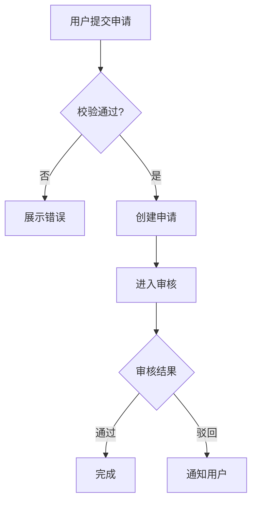

# PRD 撰写规范与模板

> Product Requirements Document Writing Guide & Template  
> Version: 1.0

---

# 1. 文档目的

本文档定义 AI 产品经理如何将前序阶段已经确认的：

* 项目背景
* 用户与场景
* 核心问题
* 产品目标
* 产品定位
* MVP Scope
* 用户故事
* 产品功能架构
* 核心业务流程
* 详细功能设计
* 状态机
* 权限规则
* 交互设计
* 低保真原型
* 验收标准

整理为一份：

> **结构清晰、逻辑完整、可评审、可开发、可测试、可追溯的 PRD。**

PRD 的主要作用不是记录产品经理“想做什么”，而是让：

* 产品
* 设计
* 前端
* 后端
* 架构
* QA
* 运营
* 项目管理

对同一个需求形成一致理解。

---

# 2. PRD 的核心定位

PRD 主要回答：

```text
为什么做
↓
给谁做
↓
解决什么问题
↓
当前版本做什么
↓
不做什么
↓
产品如何运转
↓
功能规则是什么
↓
异常如何处理
↓
如何判断开发完成
```

PRD 不应该主要回答：

```text
数据库怎么建

接口怎么设计

微服务怎么拆

代码怎么实现

部署架构怎么做
```

这些属于研发技术设计。

---

# 3. PRD 不是“设计思考现场”

进入 PRD 阶段前，重大产品问题应该已经基本想清楚。

PRD 的主要任务是：

> **整理和表达已经确认的产品设计。**

如果写 PRD 时才发现：

* 核心用户不明确
* MVP Scope 不明确
* 核心流程不闭环
* 状态机没想清楚
* 权限逻辑冲突
* 关键功能还没决定

说明前序阶段存在缺口。

应回退对应阶段解决，而不是在 PRD 中边写边猜。

---

# 4. PRD 不是越长越好

PRD 的质量不由：

> 页数

决定。

而由：

* 是否清晰
* 是否完整
* 是否一致
* 是否无歧义
* 是否能落地
* 是否可测试

决定。

简单功能可能只需要几页。

复杂新产品可能需要完整 PRD。

原则是：

> **复杂度匹配，而不是模板填满。**

---

# 5. PRD 的核心原则

## 5.1 Single Source of Truth

关键产品决策应尽量有唯一权威来源。

避免：

```text
PRD 写一种
原型写一种
群聊又说一种
会议上再改一种
```

如果发生变更：

> 应同步更新正式文档。

---

## 5.2 Why Before What

先说明：

> 为什么做。

再说明：

> 做什么。

否则研发只能执行功能，却无法理解优先级和设计意图。

---

## 5.3 Scope First

PRD 必须明确：

```text
In Scope

Out of Scope
```

否则研发过程中容易不断加入新需求。

---

## 5.4 Rule Explicit

不要把业务规则藏在：

* 截图
* 原型备注
* 聊天记录
* 会议口头约定

重要规则应明确写入 PRD。

---

## 5.5 Exception Matters

不能只写正常流程。

关键功能至少考虑：

```text
Happy Path
Alternative Flow
Exception Flow
Edge Case
```

---

## 5.6 Testable

需求必须尽量能回答：

> QA 怎么证明这个需求做对了？

如果无法验证，则需求仍然模糊。

---

# 6. PRD 文档层级

推荐结构：

```text
Product
↓
Module
↓
Feature
↓
Business Rule
↓
Acceptance Criteria
```

复杂产品可以使用：

```text
Product
↓
Domain
↓
Module
↓
Feature
↓
Sub-feature
```

不要无限增加层级。

---

# 7. PRD 标准目录

建议完整版 PRD 使用以下结构：

```text
# Product Requirements Document

## 1. 文档信息
## 2. 项目背景
## 3. 产品目标
## 4. 成功指标
## 5. 用户角色
## 6. 用户场景
## 7. 产品范围
## 8. 产品功能架构
## 9. 核心业务流程
## 10. 功能需求
## 11. 业务规则
## 12. 状态机
## 13. 权限模型
## 14. 数据需求
## 15. 异常与边界条件
## 16. 数据埋点
## 17. 非功能需求
## 18. 验收标准
## 19. 外部依赖
## 20. 风险
## 21. Open Questions
## 22. Decision Log
## 23. Change Log
```

根据项目复杂度可裁剪。

---

# 8. 文档信息

建议包含：

```markdown
## 1. 文档信息

| Field | Value |
|---|---|
| Product | |
| Document | |
| Version | |
| Status | Draft / Reviewing / Approved |
| Owner | |
| Created | |
| Last Updated | |
| Target Release | |
```

---

# 9. PRD 状态

建议使用：

## Draft

正在撰写。

## Reviewing

正在评审。

## Approved

需求已经确认。

## In Development

已进入研发。

## Released

已上线。

## Archived

历史版本。

---

# 10. Version

重要 PRD 建议维护版本号。

例如：

```text
v0.1 Draft

v0.5 Internal Review

v0.9 Requirement Review

v1.0 Approved
```

不要每改一个字都升级版本。

版本变化应对应：

> 有意义的需求变化。

---

# 11. 项目背景

背景回答：

> 为什么会有这个项目？

建议说明：

* 当前业务现状
* 用户现状
* 已存在的问题
* 触发事件
* 数据或证据
* 为什么现在做

---

# 12. 背景不要写成宣传稿

不推荐：

> 随着互联网高速发展，AI 已成为时代趋势……

推荐：

> 当前客服每天平均处理 320 条咨询，其中约 45% 为重复性问题，人工回复占据大量时间。

背景应该帮助研发理解：

> 这个需求解决的真实问题是什么。

---

# 13. Problem Statement

复杂项目建议单独写：

```text
[目标用户]
在 [核心场景]
因为 [Root Cause]
导致 [问题和影响]
```

例如：

> 运营人员在每周生成经营周报时，因为系统缺乏数据聚合能力，需要从多个页面手工复制数据，平均耗时约 2 小时，且存在数据抄录错误风险。

---

# 14. 产品目标

Product Goal 应描述：

> 希望改变什么。

例如：

```text
将周报制作时间由平均 2 小时降低到 20 分钟以内。
```

比：

> 增加报表中心。

更合理。

---

# 15. Goal / Non-Goal

复杂项目推荐：

```markdown
## Product Goals

1.
2.
3.

## Non-Goals

1.
2.
3.
```

Non-Goal 可以减少范围争议。

---

# 16. 成功指标

建议根据项目选择：

* User Outcome Metrics
* Product Metrics
* Business Metrics
* Guardrail Metrics

---

# 17. 指标模板

| Metric               | Baseline |  Target | Measurement     | Time Window |
| -------------------- | -------: | ------: | --------------- | ----------- |
| Task Completion Time |  120 min | ≤20 min | System + Survey | 30 days     |
| Success Rate         |      82% |    ≥95% | Analytics       | 30 days     |

---

# 18. 用户角色

不要只写：

> 用户。

应明确：

```text
Primary User

Secondary User

Administrator

Operator

Stakeholder
```

---

# 19. Persona 不一定必须完整

PRD 中通常不需要写：

* 爱好
* 星座
* 人生故事

除非这些信息确实影响产品设计。

更重要的是：

* 用户职责
* 使用目标
* 权限
* 场景
* 行为

---

# 20. 用户角色模板

| Role     | Description | Goal   | Frequency | Permission    |
| -------- | ----------- | ------ | --------- | ------------- |
| Operator | 运营人员        | 制作经营分析 | Daily     | View / Export |
| Admin    | 系统管理员       | 管理配置   | Low       | Full          |

---

# 21. 用户场景

场景应体现：

```text
Actor
+
Context
+
Trigger
+
Goal
+
Pain Point
+
Expected Outcome
```

---

# 22. 核心场景与次级场景

建议分：

## Core Scenario

MVP 核心使用场景。

## Secondary Scenario

重要但非首要。

## Out-of-Scope Scenario

当前版本明确不支持。

---

# 23. 产品范围

PRD 必须有明确 Scope。

推荐：

```markdown
## In Scope

- ...

## Out of Scope

- ...

## Future Consideration

- ...
```

---

# 24. Out of Scope 必须认真写

例如：

```text
自动发送 AI 回复：
Out of Scope

原因：
当前版本只验证 AI 回复建议是否有价值，自动发送涉及更高信任和误操作风险。
```

---

# 25. Scope 与版本绑定

需求必须说明属于：

```text
MVP
V1.1
Next
Later
```

避免未来功能混入当前开发范围。

---

# 26. 功能架构

PRD 中不必重复所有前序分析过程。

只保留正式结构。

例如：

```text
Product

├── Conversation
│   ├── Context Input
│   ├── Intent Understanding
│   └── Reply Generation
│
├── Reply Workspace
│   ├── Candidate Reply
│   ├── Edit
│   └── Regenerate
│
└── Settings
    └── Tone Preference
```

---

# 27. 模块说明

每个核心 Module 建议说明：

```text
Purpose

Responsibilities

Key Features

Dependencies

Out of Scope
```

---

# 28. 核心业务流程

PRD 中应该保留：

> 研发必须共同理解的核心流程。

不必将所有小流程全部绘图。

---

# 29. 业务流程结构

建议：

```markdown
## FLOW-001 创建订单

### Actor

### Trigger

### Preconditions

### Main Flow

### Alternative Flow

### Exception Flow

### Postconditions
```

必要时附 Mermaid。

---

# 30. 核心业务流程图

例如：



---

# 31. 功能需求是 PRD 核心

每个重要 Feature 都应单独形成 Specification。

建议统一使用：

```text
Feature ID

Feature Name

Goal

User Story

Actor

Scenario

Preconditions

Trigger

Main Flow

Business Rules

State

Permission

Exception

Edge Cases

UI / Interaction

Acceptance Criteria
```

---

# 32. Feature ID

建议：

```text
FEAT-001

FEAT-002
```

便于：

* 评审
* 开发任务
* 测试 Case
* 需求追踪

---

# 33. Requirement ID

如项目较复杂，可同时使用：

```text
REQ-001
US-001
FEAT-001
BR-001
AC-001
```

建立 Traceability。

小项目不要为了形式制造编号负担。

---

# 34. Feature Goal

首先说明：

> 为什么存在这个功能？

例如：

> 帮助用户在不离开当前聊天上下文的情况下快速生成符合自己表达意图的回复候选。

---

# 35. Related User Story

例如：

```text
US-012

As a 用户
I want 根据当前聊天上下文获得回复建议
So that 我可以减少思考回复内容的时间
```

---

# 36. Preconditions

例如：

```text
用户已进入回复工作区

聊天上下文已提供

输入内容不为空
```

---

# 37. Trigger

例如：

> 用户点击“生成回复”。

---

# 38. Main Flow

主流程应使用编号。

例如：

```text
1. 用户输入希望表达的内容。
2. 用户点击生成回复。
3. 系统进入生成状态。
4. 系统返回 3 条候选回复。
5. 用户选择其中一条。
6. 用户可继续编辑。
```

---

# 39. Alternative Flow

例如：

```text
A1 用户直接使用候选回复。

A2 用户编辑后使用。

A3 用户重新生成。
```

---

# 40. Exception Flow

例如：

```text
E1 AI 服务超时

系统：
- 停止 Loading
- 保留用户输入
- 提示生成失败
- 提供 Retry
```

---

# 41. Business Rules

业务规则应尽量编号：

```text
BR-001

一次最多返回 3 条候选回复。

BR-002

当输入文本超过 5,000 字时禁止生成。
```

---

# 42. 规则应避免埋藏在流程里

流程写：

> 用户点击生成。

规则写：

> 哪些条件下允许生成。

两者职责不同。

---

# 43. Data Rules

例如：

| Field   | Required | Rule        | Editable |
| ------- | -------- | ----------- | -------- |
| Intent  | Yes      | ≤500 chars  | Yes      |
| Context | Yes      | ≤5000 chars | Yes      |

---

# 44. Permission

权限至少明确：

```text
Who

Resource

Action

Condition
```

例如：

> 普通用户只能查看自己创建的草稿。

---

# 45. State

有生命周期的对象必须描述状态。

例如：

```text
Draft
↓
Generating
↓
Generated
↓
Accepted
```

失败：

```text
Generating
↓
Failed
```

---

# 46. State Transition Table

| From       | Trigger  | Actor  | Condition   | To         |
| ---------- | -------- | ------ | ----------- | ---------- |
| Draft      | Generate | User   | Input valid | Generating |
| Generating | Success  | System | -           | Generated  |
| Generating | Error    | System | -           | Failed     |

---

# 47. 不要把 UI 状态和业务状态混在一起

例如：

```text
按钮变灰
```

不是业务状态。

业务状态可能是：

> Submitted。

UI 根据业务状态决定是否 Disable。

---

# 48. Interaction Requirements

PRD 不需要做视觉设计，但需要说明关键交互。

例如：

```text
生成过程中：
- Generate 按钮 Disabled
- 显示 Generating
- 禁止重复提交
```

---

# 49. 页面引用

如果已有低保真原型，可以写：

```text
Related Page:
PAGE-006 Reply Workspace
```

不要依赖截图位置：

> “看右边那个蓝按钮。”

因为设计以后可能变化。

---

# 50. 页面状态

核心页面建议覆盖：

```text
Default

Loading

Empty

Success

Error

Disabled

No Permission
```

按实际需要使用。

---

# 51. Error Message

关键错误应定义语义。

例如：

```text
AI 服务暂时不可用，请稍后重试。
```

比：

> 请求失败。

更可用。

---

# 52. 异常与边界条件

PRD 应有独立汇总，特别适合复杂产品。

常见：

* 网络异常
* 重复提交
* 权限变化
* 并发修改
* 过期
* 空数据
* 最大值
* 最小值
* 第三方失败

---

# 53. Exception Matrix

| ID     | Scenario           | Expected Behavior | Recovery |
| ------ | ------------------ | ----------------- | -------- |
| EX-001 | Network Timeout    | 保留输入并提示           | Retry    |
| EX-002 | Permission Revoked | 阻止提交              | Back     |
| EX-003 | Duplicate Submit   | 只产生一次结果           | Ignore   |

---

# 54. Edge Case Matrix

| Case     | Expected Result |
| -------- | --------------- |
| 输入为空     | 禁止提交            |
| 输入达到最大长度 | 允许              |
| 超过最大长度   | 禁止              |
| 连续点击两次   | 只处理一次           |

---

# 55. 状态机章节

复杂状态机建议独立集中展示。

包括：

* State Definition
* Transition
* Terminal State
* Forbidden Transition

---

# 56. 状态定义模板

| State    | Meaning | Allowed Actions | Terminal |
| -------- | ------- | --------------- | -------- |
| Draft    | 未提交     | Edit / Submit   | No       |
| Approved | 已通过     | View            | Yes      |

---

# 57. 权限模型章节

权限复杂时，统一维护 Permission Matrix。

| Role | Resource | View | Edit | Delete | Approve |
| ---- | -------- | ---: | ---: | -----: | ------: |

避免各个 Feature 里写出互相冲突的权限。

---

# 58. 数据需求

产品层的数据需求包括：

* 页面需要展示什么
* 用户输入什么
* 业务需要记录什么
* 指标需要采集什么

不需要直接设计数据库。

---

# 59. Business Object

复杂产品可以写：

```text
Order

Payment

Refund

Conversation
```

说明核心字段含义和关系。

---

# 60. Data Dictionary

如果字段较多，可以维护：

| Field | Meaning | Source | Required | Rule |
| ----- | ------- | ------ | -------- | ---- |

---

# 61. 数据展示规则

例如：

```text
金额显示 2 位小数。

时间统一显示用户本地时区。

手机号默认脱敏显示。
```

---

# 62. 数据一致性要求

如果业务关键，应明确：

例如：

> 支付结果与订单支付状态不得长期不一致。

不需要产品经理定义具体事务机制。

---

# 63. 数据埋点

埋点服务于：

> 产品验证和数据分析。

不是为了“所有按钮都埋”。

---

# 64. 埋点类型

常见：

## Exposure

页面 / 内容曝光。

## Click

操作点击。

## Start

任务开始。

## Success

任务成功。

## Fail

任务失败。

## Cancel

主动放弃。

---

# 65. Event Naming

建议语义稳定。

例如：

```text
reply_generate_start

reply_generate_success

reply_generate_fail

reply_candidate_accept
```

避免：

```text
button1_click
```

---

# 66. Event Template

| Event                  | Trigger | Properties      | Purpose |
| ---------------------- | ------- | --------------- | ------- |
| reply_generate_success | AI 生成成功 | duration, count | 计算成功率   |

---

# 67. 埋点属性

例如：

```text
user_type

source

feature_version

result_count

duration

error_type
```

只采集真正用于分析的属性。

---

# 68. Metric 与 Event 关系

例如：

```text
AI 回复采纳率
=
reply_candidate_accept
/
reply_generate_success
```

PRD 应尽量说明关键指标如何测量。

---

# 69. 非功能需求

Non-Functional Requirements 不是越多越好。

按实际业务需求选择：

* Performance
* Availability
* Security
* Privacy
* Accessibility
* Compatibility
* Scalability
* Localization
* Auditability

---

# 70. Performance

例如：

```text
普通列表加载：
P95 ≤ 2 秒

AI 生成：
需要在 1 秒内显示明确的“生成中”反馈
```

不要随意写极端指标。

---

# 71. Availability

关键业务可以要求：

> 支付核心链路需要高可用。

普通内部工具未必需要写 99.999%。

---

# 72. Security

产品层可能定义：

* 权限隔离
* 敏感操作确认
* 登录要求
* 高风险操作审计
* 数据访问边界

---

# 73. Privacy

例如：

* 用户可删除历史聊天
* 敏感信息默认脱敏
* AI 是否保存输入
* 用户是否可关闭数据使用

---

# 74. Accessibility

如果适用：

* 键盘操作
* Focus
* 不只使用颜色
* 表单 Label
* 错误可理解

---

# 75. Compatibility

例如：

```text
Web：
Chrome 最近两个主版本

Mobile：
iOS / Android
```

只有真正有要求时写。

---

# 76. 国际化

需要全球用户时考虑：

* Language
* Time Zone
* Currency
* Date Format
* Number Format
* Text Length

---

# 77. 验收标准

Acceptance Criteria 是：

> PRD 是否真正可测试的核心。

---

# 78. 验收标准必须覆盖

至少：

```text
Positive

Negative

Boundary
```

复杂流程还应覆盖：

* Permission
* State
* Exception
* Concurrent Scenario

---

# 79. Given / When / Then

推荐格式：

```text
Given

When

Then
```

---

# 80. Positive Case

```text
Given
用户拥有创建项目权限

When
用户填写合法项目名称并提交

Then
项目创建成功
AND
进入项目详情页
AND
项目状态 = Active
```

---

# 81. Negative Case

```text
Given
用户没有创建项目权限

When
用户尝试提交创建请求

Then
系统拒绝操作
AND
不创建项目
AND
提示无权限
```

---

# 82. Boundary Case

```text
Given
项目名称最大长度为 50 字符

When
用户输入 50 字符

Then
允许提交

When
用户输入 51 字符

Then
禁止提交
```

---

# 83. 不推荐模糊验收标准

不推荐：

> 页面体验良好。

> 系统正常运行。

> 提示友好。

这些无法客观测试。

---

# 84. Definition of Done 与 Acceptance Criteria

Acceptance Criteria：

> 这个 Feature 的业务结果是否正确。

Definition of Done：

> 团队开发流程是否完成。

例如：

* Code Review
* Test Pass
* Docs Updated

后者通常属于研发团队规范。

---

# 85. 外部依赖

需要记录：

```text
Dependency

Owner

Purpose

Required By

Risk

Fallback
```

---

# 86. 外部依赖示例

```text
短信服务

支付平台

第三方登录

地图服务

AI Model Provider

公司内部用户中心
```

---

# 87. Dependency Risk

如果依赖尚未确认：

> 必须显式标记。

不要默认它一定可用。

---

# 88. Fallback

例如：

```text
AI 服务不可用：

允许用户切换手动输入模式。
```

---

# 89. 风险章节

建议至少分析：

* Product Risk
* User Risk
* Business Risk
* Technical Dependency Risk
* Security / Privacy Risk
* Schedule Risk

---

# 90. Risk Template

| Risk | Probability | Impact | Mitigation | Owner |
| ---- | ----------- | ------ | ---------- | ----- |

---

# 91. Product Risk 示例

```text
用户可能认为 AI 回复“不像自己”。

Mitigation：
支持语气偏好、编辑和重新生成。
```

---

# 92. Open Questions

任何尚未确认的重要问题：

> 不要自行脑补。

统一记录。

---

# 93. Open Question Template

| ID | Question | Why It Matters | Blocking | Owner | Status |
| -- | -------- | -------------- | -------- | ----- | ------ |

---

# 94. Blocking Question

以下通常属于 Blocking：

* MVP Scope
* 金额规则
* 核心状态
* 权限
* 法律合规
* 核心业务逻辑

---

# 95. 非 Blocking Question

例如：

> 空状态插图最终使用哪一种？

通常不需要阻塞研发。

---

# 96. Decision Log

记录关键产品决策。

| ID | Decision | Context | Reason | Impact | Status |
| -- | -------- | ------- | ------ | ------ | ------ |

---

# 97. Decision 与 Requirement 不同

Requirement：

> 产品需要什么。

Decision：

> 多个合理方案中最终选择哪个。

---

# 98. Decision 示例

```text
D-007

Decision:
MVP 不支持 AI 自动发送消息。

Reason:
需要先验证用户对 AI 建议的信任程度。

Impact:
用户必须人工确认并发送。
```

---

# 99. Change Log

PRD 进入评审后，重要变更应记录。

| Version | Date | Change | Reason | Owner |
| ------- | ---- | ------ | ------ | ----- |

---

# 100. Change Log 不记录排版修改

只记录影响：

* Scope
* Flow
* Rule
* State
* Permission
* Acceptance

的实际需求变化。

---

# 101. Traceability

大型项目建议维护：

```text
Problem
↓
Requirement
↓
User Story
↓
Feature
↓
Business Rule
↓
Acceptance Criteria
↓
Analytics
```

---

# 102. Traceability Matrix

| Requirement | Story | Feature | Rule | AC |
| ----------- | ----- | ------- | ---- | -- |

帮助发现：

* 功能没有需求来源
* 需求没有实现
* 规则没有测试

---

# 103. PRD 中的原型

PRD 可以引用：

* Low-Fi Wireframe
* High-Fi Design
* Figma
* Page Specification

但：

> 原型不能替代业务规则文字。

---

# 104. 截图不是需求

截图只能辅助表达。

因为：

* UI 会变化
* 截图无法描述异常
* 截图无法描述权限
* 截图无法描述状态转换

---

# 105. PRD 与 UX 文档分工

PRD：

> 产品规则、范围、流程、功能、验收。

UX：

> 页面结构、交互、状态、导航。

二者应相互引用，而不是重复全部内容。

---

# 106. PRD 与技术设计分工

PRD 定义：

```text
What
Why
Behavior
Acceptance
```

技术设计定义：

```text
Architecture
API
Database
Concurrency Implementation
Infrastructure
```

---

# 107. 技术限制可以进入 PRD

如果技术约束影响用户体验或产品 Scope，可以记录。

例如：

> MVP 暂不支持实时语音，因为当前语音模型延迟无法满足目标体验。

这是产品决策。

---

# 108. 不要代研发设计技术实现

不推荐：

> 这里必须使用 Redis 分布式锁。

更合适：

> 对同一订单重复提交退款请求不得产生重复退款结果。

研发决定如何实现。

---

# 109. AI 产品 PRD 特殊要求

AI 功能需要额外明确：

* 输入
* 上下文
* 输出
* 生成状态
* 用户控制
* Failure
* Fallback
* Safety
* Privacy
* Quality Evaluation

---

# 110. AI Input

明确：

> AI 能看到什么信息？

例如：

* 当前用户输入
* 当前对话
* 历史记忆
* 知识库

---

# 111. AI Output

明确：

* 输出形式
* 数量
* 是否流式
* 是否可编辑
* 是否可重新生成

---

# 112. AI Uncertainty

如果模型无法保证正确：

PRD 应说明：

> 用户不能把 AI 输出视为确定事实。

高风险领域需要更强约束。

---

# 113. Human Confirmation

涉及：

* 对外发送
* 删除
* 金额
* 合同
* 高风险操作

时，应判断是否：

> Human-in-the-loop。

---

# 114. AI Failure

至少考虑：

```text
Timeout

Provider Error

Unsafe Output

No Result

Low Quality

Context Too Long
```

---

# 115. AI Fallback

例如：

```text
生成失败
↓
允许 Retry
↓
仍失败
↓
允许用户手动输入
```

---

# 116. AI Quality Metric

AI Feature 的指标不能只有：

> 请求成功率。

还应根据产品价值考虑：

* Acceptance Rate
* Edit Rate
* Regenerate Rate
* User Satisfaction
* Task Completion
* Error Rate

---

# 117. PRD 写作语言

要求：

* 清晰
* 具体
* 一致
* 少歧义
* 少空话

---

# 118. 使用确定性词汇

不推荐：

> 尽量

> 一般情况下

> 比较快

> 适当

> 必要时

除非明确说明判断条件。

---

# 119. 避免主语缺失

不推荐：

> 点击后更新状态。

推荐：

> 用户点击“确认收货”后，系统将订单状态更新为“已完成”。

---

# 120. 避免代词歧义

长需求中少用：

> 它、这个、那个。

优先写明确对象名称。

---

# 121. 一个规则只表达一个核心逻辑

复杂规则尽量拆分编号。

不要写成几百字大段。

---

# 122. 表格适用场景

适合表格：

* 权限
* 状态
* 字段
* Rule Matrix
* Scope
* Metrics

---

# 123. 流程图适用场景

适合：

* 跨角色
* 多分支
* 生命周期流程

---

# 124. 自然语言适用场景

适合：

* 背景
* Goal
* 设计原则
* 风险解释

不要什么都做成表格。

---

# 125. PRD 简化版

对于小型 Feature，可使用：

```markdown
# Feature PRD

## Background

## Goal

## User

## Scenario

## Scope

## User Story

## Flow

## Requirements

## Business Rules

## Exception

## Acceptance Criteria

## Analytics

## Risks

## Open Questions
```

---

# 126. 中型项目 PRD

建议包含：

```text
Background
Goal
Metrics
User
Scenario
Scope
Architecture
Core Flow
Feature Specs
Rules
State
Permission
Exception
Analytics
Acceptance
Risk
Open Questions
```

---

# 127. 大型新产品 PRD

建议采用完整模板。

但也可以：

> 总 PRD + 子模块 PRD。

避免一个文档巨大到无法维护。

---

# 128. Master PRD + Module PRD

大型产品推荐：

```text
Master PRD

├── Product Overview
├── Scope
├── Architecture
├── Core Flow
│
├── Module PRD - User
├── Module PRD - Order
├── Module PRD - Payment
└── Module PRD - Admin
```

---

# 129. 什么时候拆 PRD

出现以下情况可考虑拆：

* 文档过长
* 多团队并行开发
* 模块相对独立
* Release 不同
* Owner 不同

---

# 130. 不要拆得太碎

如果每个按钮一个 PRD：

> 上下文会严重碎片化。

---

# 131. PRD Review 前自检

## Problem

* [ ] 为什么做清楚
* [ ] 用户问题清楚

## Goal

* [ ] Product Goal 清楚
* [ ] Success Metric 清楚

## Scope

* [ ] In Scope 清楚
* [ ] Out of Scope 清楚

## User

* [ ] Actor 清楚
* [ ] Scenario 清楚

## Architecture

* [ ] 功能结构清楚

## Flow

* [ ] Core Flow 闭环

## Feature

* [ ] 关键 Feature 有详细说明

## Rule

* [ ] Business Rule 明确

## State

* [ ] 核心状态明确

## Permission

* [ ] 权限边界明确

## Exception

* [ ] 核心失败场景明确
* [ ] Edge Case 基本覆盖

## UX

* [ ] 核心页面和交互明确

## QA

* [ ] Acceptance Criteria 可测试

## Data

* [ ] 核心数据需求明确
* [ ] 必要 Analytics 已定义

## Risk

* [ ] Risks 已记录
* [ ] Blocking Open Questions 已解决或明确

---

# 132. PRD Ready Gate

进入 Requirement Review 前应达到：

```text
Why Clear

Who Clear

What Clear

Scope Clear

Flow Closed

Rule Clear

State Clear

Permission Clear

Exception Clear

Acceptance Testable
```

满足：

> READY FOR REQUIREMENT REVIEW

否则：

> CONTINUE PRD / RETURN TO PREVIOUS PHASE

---

# 133. PRD 完整模板

```markdown
# Product Requirements Document

## 1. 文档信息

| Field | Value |
|---|---|
| Product | |
| Version | |
| Status | |
| Owner | |
| Created | |
| Updated | |
| Target Release | |

---

## 2. 项目背景

### 2.1 Background

### 2.2 Problem Statement

### 2.3 Why Now

---

## 3. 产品目标

### 3.1 Product Goals

### 3.2 Non-Goals

---

## 4. 成功指标

### 4.1 User Outcome Metrics

### 4.2 Product Metrics

### 4.3 Business Metrics

### 4.4 Guardrail Metrics

---

## 5. 用户角色

### 5.1 Primary User

### 5.2 Secondary User

### 5.3 Stakeholders

---

## 6. 用户场景

### 6.1 Core Scenario

### 6.2 Secondary Scenarios

---

## 7. 产品范围

### 7.1 In Scope

### 7.2 Out of Scope

### 7.3 Future Consideration

---

## 8. 产品功能架构

### 8.1 Capability Map

### 8.2 Module Map

### 8.3 Feature Tree

---

## 9. 核心业务流程

### FLOW-001

#### Goal

#### Actor

#### Trigger

#### Preconditions

#### Main Flow

#### Alternative Flow

#### Exception Flow

#### Postconditions

---

## 10. 功能需求

### FEAT-001

#### Feature Name

#### Goal

#### Related User Story

#### Actor

#### Scenario

#### Preconditions

#### Trigger

#### Main Flow

#### Alternative Flow

#### Business Rules

#### Data Rules

#### Permission

#### State Transition

#### Exception Flow

#### Edge Cases

#### UI / Interaction

#### Page States

#### Notifications

#### Audit

#### Analytics

#### Acceptance Criteria

#### Dependencies

#### Risks

#### Open Questions

---

## 11. 业务规则

| Rule ID | Rule | Applies To | Priority |
|---|---|---|---|

---

## 12. 状态机

### 12.1 State Definition

| State | Meaning | Allowed Actions | Terminal |
|---|---|---|---|

### 12.2 State Transition

| From | Trigger | Actor | Condition | To |
|---|---|---|---|---|

---

## 13. 权限模型

| Role | Resource | View | Create | Edit | Delete | Approve |
|---|---|---|---|---|---|---|

---

## 14. 数据需求

### 14.1 Core Business Objects

### 14.2 Data Dictionary

### 14.3 Display Rules

---

## 15. 异常与边界条件

### 15.1 Exception Matrix

| ID | Scenario | Expected Behavior | Recovery |
|---|---|---|---|

### 15.2 Edge Cases

| Case | Expected Result |
|---|---|

---

## 16. 数据埋点

| Event | Trigger | Properties | Metric |
|---|---|---|---|

---

## 17. 非功能需求

### 17.1 Performance

### 17.2 Availability

### 17.3 Security

### 17.4 Privacy

### 17.5 Accessibility

### 17.6 Compatibility

---

## 18. 验收标准

### AC-001

Given:

When:

Then:

---

## 19. 外部依赖

| Dependency | Owner | Purpose | Risk | Fallback |
|---|---|---|---|---|

---

## 20. 风险

| Risk | Probability | Impact | Mitigation | Owner |
|---|---|---|---|---|

---

## 21. Open Questions

| ID | Question | Why It Matters | Blocking | Owner | Status |
|---|---|---|---|---|---|

---

## 22. Decision Log

| ID | Decision | Context | Reason | Impact |
|---|---|---|---|---|

---

## 23. Change Log

| Version | Date | Change | Reason |
|---|---|---|---|
```

---

# 134. AI 产品经理生成 PRD 的规则

AI 在生成正式 PRD 前，应检查：

```text
是否已经完成关键需求分析？

Product Definition 是否明确？

MVP Scope 是否明确？

Core User Stories 是否明确？

Business Flow 是否闭环？

Feature Rules 是否足够清晰？

State / Permission 是否按需定义？

UX 是否已经基本明确？
```

如果答案大量为否：

> 不应该直接制造完整 PRD。

---

# 135. 不确定信息的处理

如果用户未提供某个关键规则：

禁止：

> 自行编造成已确认事实。

应该：

```text
Assumption:
当前暂定退款期限为 7 天，尚待业务确认。
```

或者：

```text
Open Question:
OQ-005
退款有效期具体是多少？
```

---

# 136. AI 不应制造“看似完整”的假 PRD

最危险的 PRD 是：

> 文档格式完整，但大量业务规则其实都是模型猜的。

因此：

> **完整性不能高于真实性。**

---

# 137. AI PRD 输出优先级

优先保证：

```text
正确
>
无歧义
>
完整
>
格式漂亮
```

---

# 138. AI 应主动发现冲突

例如：

Scope 写：

> MVP 不支持管理员审核。

Feature 又写：

> 管理员审核退款。

应主动指出：

> Scope Conflict。

---

# 139. AI 应主动检查状态冲突

例如：

Business Rule：

> 已完成订单可以退款。

State Machine：

> Completed 是不可操作终态。

必须指出冲突。

---

# 140. AI 应主动检查权限冲突

例如：

Permission Matrix：

> Operator 不可删除。

Feature：

> 运营人员点击删除。

必须指出。

---

# 141. AI 应主动检查验收遗漏

每个核心 Rule 都应尽量找到：

> 对应 Acceptance Criteria。

---

# 142. AI 应主动检查 Scope Creep

如果 PRD 出现未经过 MVP 规划的新 Feature：

应标记：

> New Scope / Unplanned Feature

并要求判断：

* 是否进入本版本
* 是否移到 Next
* 是否 Reject

---

# 143. PRD Review 输入准备

进入下一阶段前应准备：

```text
PRD

Wireframe / Prototype

Business Flow

State Machine

Permission Matrix

Acceptance Criteria

Known Risks

Open Questions
```

---

# 144. 最终质量标准

一份高质量 PRD 应让：

## 产品

知道为什么做、做什么、不做什么。

## UX/UI

知道用户任务、页面结构和状态。

## Frontend

知道页面行为、交互、状态和反馈。

## Backend

知道业务规则、状态、权限和数据行为。

## QA

知道如何验证成功、失败和边界条件。

## Project Manager

知道 Scope、依赖和风险。

---

# 145. 最终工作原则

PRD 的本质不是：

> 一份很长的需求说明书。

而是：

> **一个跨团队共享的产品决策与需求契约。**

始终牢记：

> PRD 不负责掩盖未知问题，而负责暴露未知问题。

> PRD 不应该把产品经理的猜测包装成事实。

> PRD 不应该用漂亮原型掩盖业务逻辑缺失。

> PRD 不应该让研发通过猜测理解产品。

> PRD 必须明确当前版本做什么，也必须明确不做什么。

> 每一个重要需求，都应该能够从问题一路追溯到验收标准。

最终形成：

```text
Problem
↓
Goal
↓
Scope
↓
User Story
↓
Feature
↓
Business Rule
↓
State / Permission
↓
Interaction
↓
Acceptance Criteria
↓
Metric
```

当这条链路完整、无重大冲突、关键未知项已经解决时，PRD 才真正具备进入正式需求评审的条件。

最终状态：

> **READY FOR REQUIREMENT REVIEW**
